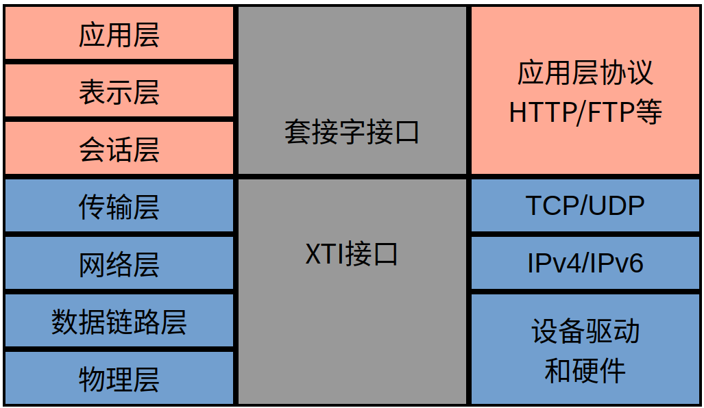
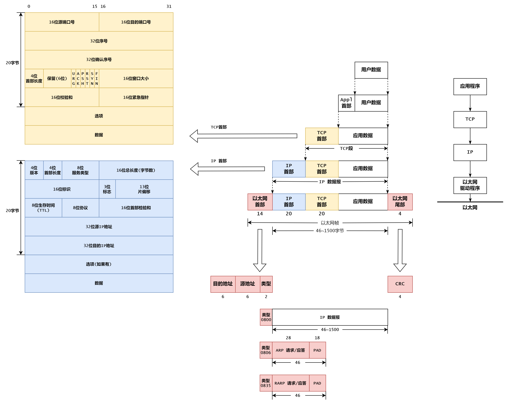
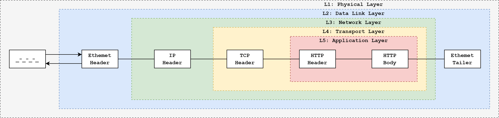
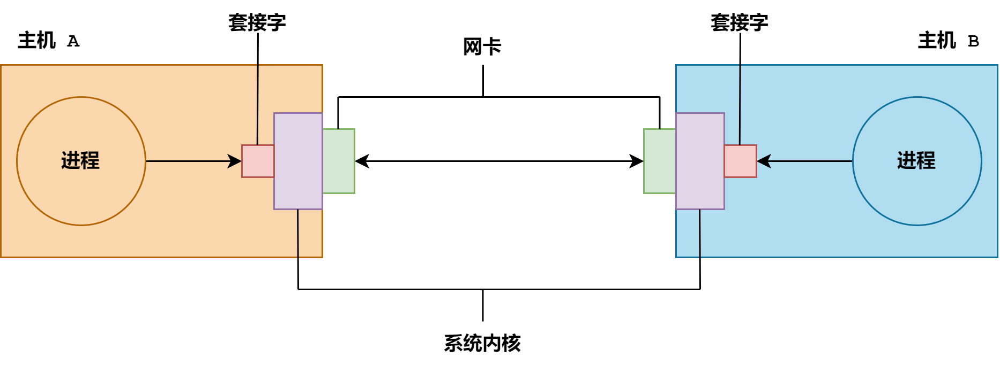

# OSystem

## 🎇UC 
使用 C语言在操作系统 Unix上的用户编程, Unix系统向用户提供了大量的接口, 用户通过系统提供的接口, 可以使用操作系统提供的服务

## 🎇环境变量
- 每个进程都有一张自己的环境变量表, 表中每个条目都是形如 `"Key=Value"` 形式的环境变量
- 进程可以通过环境变量访问计算机的资源
- 在终端下输入 `env`命令, 可以查看环境变量列表
- 通过 `echo $name` 命令可以查看名为 `name` 的环境变量的值
- 环境变量分为两大类: 包括 ***全局环境变量*** 和 ***局部环境变量***
  - 全局环境变量: 当前 Shell和其子程序都是可见的
  - 局部环境变量: 只有当前 Shell可见
  - 可用 `export name` 将局部环境变量设置成全局环境变量
  - 可用 `unset name` 删除环境变量
- 环境变量的添加: 在终端中输入 `NAME=PATH` 命令即可向 ***当前进程*** 添加名为 `NAME`,值为 `PATH` 的环境变量, 如果环境变量已经存在, 就修改其值
- ⭐ 特别注意 `=` 左右 ***不能加空格***
  - 例如 `NAME = PATH` 就是错误的写法
- 常见的环境变量:
  - **PATH 环境变量:** 
    - 个人 Ubuntu下的 PATH路径: `/usr/local/sbin:/usr/local/bin:/usr/sbin:/usr/bin:/sbin:/bin:/usr/games:/usr/local/games:/snap/bin`
    - 可以使用 `echo $PATH` 进行查看
    - 该环境变量所记录的是bash进程对命令的检索路径
    - 格式为 " **:** " 分割的多个路径, 当在 bash下输入命令的时候, 首先在第一个路径下找该命令的可执行程序, 找到就执行, 不再向后寻找, 找不到就向后寻找, 直到找到为止, 如果最后一个路径找不到, 就提示该命令不能找到的错误信息
    - 使用 `PATH=$PATH:.` 表示在原有路径上添加 `:.` , 即查找在执行命令时添加查找当前目录(仅在当前进程有效)
  - 如果没有特殊的操作, 对环境变量的设置仅对带你给钱的 Shell进程有效, 开启新的终端, 之前的操作不会保留
  - 在 ***用户主目录*** 下有名为 `.bashrc` 的脚本文件, 每次 _bash_ 进程启动前, 都会执行脚本文件的内容
  - 如果希望环境变量的设置对每个 _bash_ 进程都有效, 可以将环境变量的设置写在该脚本文件中
  - 执行 `source ~/.bashrc` 命令, 可以使文件立即生效
  - `nilera@nilera-virtual-machine:~$` 这个是 Linux中的提示符, 受 `PS` 路径控制, 例如:使用 `PS1='\W\$'` 命令可以只显示当前目录

## 🎇环境变量表
- 每个进程都有一张独立的环境变量表, 其中的每个条目都是一个形如 `"Key=Value"` 形式的环境变量
- 所谓的环境变量表就是一个 ***以 NULL指针结束的字符指针数组***, 其中的每个元素都是一个字符指针, 指向一个以空字符结尾的字符串, 该字符串就是形如 `"Key=Value"` 形式的环境变量, 该指针数组的地址保存在全局变量 `environ` 中

##  🎇涉及内容:
- [Done] 库文件的制作和使用
- [Done] 内存管理
- [Done] 文件管理和文件系统
- [Done] 进程管理
- [Done] 信号(软中断)
- [Done] 进程间通讯
- [Doing] 网络管理
- [Doing] 线程管理

### ✨ 库文件的制作和使用
**单一模型:** 将程序所有的功能全部实现与一个单一源文件的内部, 编译时间长, 不易于维护和升级, 不易于协作开发<p>

**分离模型:** 将程序的不同功能划分到不同的源文件中, 缩短编译时间, 易于协作开发, 不易于管理多个目标文件<p>

**什么是库文件:** 对多个目标文件的管理比较麻烦, 将多个目标文件统一整合成一个库文件<p>

***Q&A :***<p>
**_Q :_** 为什么要把一个程序分成多个源文件, 并由每个元文件编译生成独立的目标文件? <p>
**_A :_** 易于维护, 便于协作 <p>
**_Q :_** 为什么要把多个目标文件合并成一个库文件<p>
**_A :_** 易于使用, 方便复用<p>

可以简单的把库文件看成一种代码仓库, 他提供给使用者一些可以拿来使用的变量、函数或类<p>
库文件一般指计算机上的一类文件, 分 ***静态库*** 和 ***动态库*** 两种
- 静态库
  - 静态库的本质就是将多个目标文件打包成一个文件
  - 链接静态库就是将库中被调用的代码复制到调用模块中
  - 静态库的拓展名为 `.a` , 例如 `libxxx.a` 习惯在库前加 `lib` 表明其为一个库文件
  - 如何制作一个静态库 --> 查看 `./01_dir_lib/static_lib` 文件夹内容

- 动态库
  - 动态库和静态库不同, 链接动态库不需要将被调用的函数代码复制到包含调用代码的可执行文件中, 相反链接器会在调用语句处嵌入一段指令, 在该程序执行到这段指令时, 会加载该动态库并寻找被调用函数的入口地址, 并且执行该指令
  - 如果动态库中的代码同时被多个进程所用, 动态库在内存的实例仅需一份, 为所有使用该库的进程所共享, 因此动态库又叫共享库
  - 动态库的拓展名为 `.so` , 例如 `libxxx.so` 

- 静态库和动态库比较
  - 动态库: 占用内存小, 相对较慢, 程序执行必须依赖库
  - 静态库: 占用内存大, 相对较快, 程序执行不必依赖库
  - 实际开发中还是使用动态库更多, 因为动态库可以 _**更方便的**_ 进行产品的维护和迭代, 而静态库较为麻烦

- 动态库的动态加载
  - 在程序执行的过程中, 开发人员可以动态加载共享库(什么时候用什么时候加载, 减少内存资源的浪费)
  - 在程序中动态加载的动态库需要调用一组特殊的函数, 他们被声明于一个专门的头文件中, 并在一个独立的库中予以实现
  - 使用这组函数需要包含 `#include <dlfcn.h> `头文件, 并链接该库
  - **辅助工具 :**
    > 查看符号表 : nm <p>
    列出目标文件、可执行程序、静态库或共享库中的符号<p>
    例如 : `nm libmath.a`

    > 查看依赖 : ldd <p>
    查看可执行文件或者共享库所依赖的共享库 <p>
    例如 : `ldd a.out`


**相关函数:**<p>
_**`void* dlopen(char const* filename, int flag)`**_
  - 功能 : 将共享库载入内存并获得其访问句柄
  - 参数 : <p>
  **filename :** 动态库路径, 若只给文件名不带目录, 则根据 `LD_LIBRARY_PATH` 环境变量的值搜索动态库<p>
  **flag :** 加载方式, 可取以下值: <p>
  `RTLD_LAZY` - 延迟加载, 使用动态库中符号时才真正加载进内存 <p>
  `RTLD_NOW` - 立即加载 <p>
  **返回值 :** 成功返回动态库访问句柄, 失败返回 NULL <p>
  **句柄 :** 句柄唯一标识了系统内核所维护的共享库对象, 将作为后续幻术调用的参数

_**`void* dlsym(void* handle, char const* symbol)`**_
- 功能 : 从已被加载的动态库中获得特定名称的符号地址
- 参数 : <p>
  **handle :** 动态库访问句柄 <p>
  **sysbol :** 符号名 <p>
  **返回值 :** 成功返回给定符号的地址, 失败返回 NULL <p>
  该函数所返回的指针为 `void*` 类型, 需要构造与实际目标相一致类型的指针, 才能使用 <p>

_**`void* dlclose(void* handle)`**_
- 功能 : 从内存中卸载动态库
- 参数 : <p>
  **handle :** 动态库访问句柄 <p>
  **返回值 :** 成功返回 0, 失败返回非 0 <p>
- 所卸载的共享库并不一定真的从内存中立即消失, 因为其他程序可能还需要使用该库
- 只有所有使用该库的程序都显式或隐式地卸载了该库, 该库所占用的空间才会得到真正的释放
- 无论所卸载的共享库是否阵阵被释放, 传递给 dlclose函数的句柄都会在该函数成功返回后立即失效 <p>

_**`char* dlerror(void)`**_
- 功能 : 获取正在加载、使用和卸载共享库过程中所发生的错误
- **返回值 :** 有错误则返回指向错误信息字符串的指针, 否则返回 NULL

- ```
  if(!handle){
      fprintf(stderr, "dlopen: %s\n", dlerror());
      exit(EXIT_FAILURE);
  }
  ```
**错误处理 :** <p>
- 通过错误号了解具体的错误原因
  - 系统定义的整数类型全局变量 errno中存储了最近一次系统调用的错误编号
  - 头文件 `errno.h` 包含了对errno全局变量的外部生命和各种错误号的宏定义
  - `/usr/include/errno.h`
  - `/usr/include/asm-generic/errno.h`
  - `/usr/include/asm-generic/errno-base.h`

_**`char* stderror(int errnum)`**_ <p>
- 使用时需引用 `#include <string.h>` 头文件
- 功能 : 将整数形式的错误号转换为有意义的字符串
- 参数 : <p>
  **errnum :** 错误号 <p>
  **返回值 :** 返回与参数错误号对应的描述字符串 <p>

_**`void perror(char const* tag)`**_ <p>
- 使用时需引用 `#include <stdio.h>` 头文件
- 功能 : 在**标准出错设备**上打印最近一次函数调用的错误信息 <p>
- 参数 : <p>
  **tag :** 用户自己制定的提示内容, 输出时, 会自动在该提示内容和错误信息之间添加冒号进行分隔

---

### ✨ 内存管理
**程序的运作** <p>
- 我们写好的代码经过编译后得到可执行文件 `a.out` <p>
- `a.out` 是二进制指令的集合, 其内容经操作系统的管理调度被加载到物理内存, CPU在从物理内存中读取指令执行<p>
- 程序被加载到物理内存, 才能被 CPU所执行, 物理内存的空间有限, 当难以满足使用需求时, 会把一些长期闲置的代码和数据从物理内存缓存到磁盘上, 即**页面换出**, 一旦需要使用那些代码的数据, 再把他们从磁盘上恢复到物理内存中, 即**页面换入** <p>
- 磁盘上用来缓存物理内存数据的部分称为**交换分区** <p>
- 磁盘的读写速率要**远慢于**物理内存, 大量的数据换入和换出会导致电脑卡顿 <p>

**物理内存和虚拟内存**
- 虚拟地址有点像逻辑地址, 但是需要注意他们不是一个东西
- 我们在程序中所看到或者使用的地址, 并非是真实的物理内存的地址, 而是经由系统内核的内存管理系统管理后看到的虚拟地址
- 虚拟地址和物理地址之间存在映射对应关系 - 系统会维护一张内存映射表 - 物理内存(???)**透明**, 虚拟地址(###)被给予程序员
  | 物理内存 | 虚拟内存 |
  | :-: | :-: |
  | ??? | ### |

- 内存管理系统一方面**保证物理内存的安全**, 避免物理内存被直接操作, 同时也**降低了程序员的编码难度**
- CPU中包含一个名为 `MMU(Memory Management Unit)`的内存管理单元, 负责完成虚拟地址和物理地址之间的转换

**虚拟地址空间**
- 虚拟地址出现的范围即虚拟地址空间
  - 以 32位系统为例, 虚拟地址出现的范围为:
  **0x00000000 -> 0xffffffff** 也就是 `4G` , 其中 `0~3G-1`为用户所使用, 称为**用户地址空间** , `3G~4G-1` 归内核使用, 称为**内核地址空间** 
  - 64位系统中用户地址空间范围为: **0x0000 0000 0000 0000 -> 0x0000 ffff ffff ffff** , 内核地址空间为: **0x ffff 0000 0000 0000 -> 0xffff ffff ffff ffff** , 内核地址空间和用户地址空间之间是不规范地址空间, 不允许使用
- _那么我们的内存条不会产生资源的浪费吗 ?_ => **并不会** => 操作系统为每个进程都维护了一张**内存映射表** , <u> *也就是说两个不同的进程可能存在相同的虚拟地址, 但是实际上对应的物理地址并不相同, 具体的物理地址在内存映射表中记录, 目前操作系统内核可以维护 `7000+` 的内存映射表* </u>
- 对于 32位的操作系统而言, 每个进程都有 4G大小的虚拟地址空间
- 所谓的虚拟地址空间本质就是一个地址范围, 表示程序的寻址能力

**虚拟地址空间布局** <p>
_(栈区在高地址, 代码区在低地址)_ <p>
| 参数和环境区 | 命令行参数和环境变量 |
| :-: | :-: |
|栈区(Stack)|非静态局部变量|
| ⬇ |堆栈增长预留的空间|
| ⬆ |共享库共享内存等|
|堆区(Heap)|动态内存分配|
| BSS 区(BSS)|未被初始化的全局和静态局部变量|
| 数据区(Data)|不具常属性且被初始化的全局和静态局部变量|
| 代码区(Text)|可执行指令、字面值常量、具有常属性且被初始化的全局和静态局部变量|

**内存壁垒** <p>
在 **虚拟地址空间** 中提到以下内容 : <p>
> 那么我们的内存条不会产生资源的浪费吗 ? => 并不会 => 操作系统为每个进程都维护了一张内存映射表 , _**也就是说两个不同的进程可能存在相同的虚拟地址, 但是实际上对应的物理地址并不相同, 具体的物理地址在内存映射表中记录**_ , 目前操作系统内核可以维护 7000+ 的内存映射表

每个进程的用户空间都是 `0~3G-1`, 但他们所对应的物理内存却是各自独立的, 系统为每个进程的用户空间维护一张专属于该进程的内存映射表, 记录虚拟内存到物理内存的对应关系, 因此在不同进程之间交换虚拟内存是毫无意义的<p>
所有进程的内核空间都是 `3G~4G-1`, 他们所对应的物理内存只有一份, 系统为所有进程的内核空间维护一张内存映射表 `init_mm.pgd`, 记录虚拟内存到物理内存的对应关系, 因此不同进程通过系统调用所访问的内核代码和数据是同一份 <p>
*那么多个进程访问物理内存不会出错吗* -> **不会** -> 各个进程以时间片轮转的方式来使用内存 <p>

**段错误** <p>
一切对虚拟地址的越权访问, 都会导致段错误
- 试图访问没有映射到物理内存的虚拟内存
- 试图以非法的方式访问虚拟内存, 如对`只读内存(代码区的数据)`做写操作等

**内存管理** <p>
从底层硬件到上层应用, 各层都提供了各自内存管理接口, 身处不同的开发层次, 会使用不同层次的功能函数 <p>
| 开发层次 | 功能函数 | 层级 |
| :-: | :-: | :-: |
| 应用程序 | 业务逻辑 | 用户层 |
| STL | 标准容器/内存分配器 | 用户层 |
| C++ | new/delete | 用户层 |
| C | malloc/calloc/realloc/free | 用户层 |
| POSIX | sbrk/brk | 用户层 |
| Linux | mmap/munmap | 用户层 |
| 操作系统内核 | kmalloc/vmalloc | 系统层 |
| 硬件驱动程序 | get_free_page | 系统层 |
| 硬件 | 硬件指令集 | 系统层 |

**内存映射的建立与解除** <p>
**相关函数 :** <p>
_**`void* mmap(void* start, size_t length, int prot, int flags, int fd, off_t offset)`**_ <p>
- 使用时需引用 `#include <sys/mman.h>` 头文件
- 功能 : 建立虚拟内存到物理内存或磁盘文件的映射
- 参数 : <p>
  **start :** 映射区虚拟内存的起始地址, `NULL`系统自动选定后返回, 程序员在编程时最好制为 `NULL` <p>
  **length :** 映射区字节数, 自动按页调整, `1页 = 4096字节`, 当申请的空间不足一页时, 分配一页; 超过一页时, 分配两页 <p>
  **prot :** 映射区操作权限, 可取以下值 : <p>
  `PROT_READ` 映射区可读 <p>
  `PROT_WRITE` 映射区可写 <p>
  `PROT_EXEC` 映射区可执行 <p>
  `PROT_NONE` 映射区不可访问 <p> 
  当又想读又想写的时需要将相应的参数进行按位或运算, 如: `PROT_READ | PROT_WRITE` <p>
  **flags :** 映射标志, 可取以下值 : <p>
  `MAP_ANONYMOUS` 匿名映射, 将虚拟内存映射到物理内存而非文件, 忽略 `fd` 和 `offset` 参数 <p>
  `MAP_PRIVATE` 对映射区的写操作只反映到缓冲区中, 并不会真正写入文件 <p>
  `MAP_SHARED` 对映射区的写操作直接反映到文件中<p>
  `MAP_DENYWRITE` 拒绝对其他文件的写操作 <p>
  `MAP_FIXED` 若在start上无法创建映射, 则失败(无次标志系统会自动调整) <p>
  `fp` 文件描述符 <p>
  `offset` 文件偏移量, 自动按页(4K)对齐 <p>
  当不进行文件操作时 _`MAP_ANONYMOUS`_ 参数必须包含, _`MAP_PRIVATE`_ 和 _`MAP_SHARED`_ 两个参数必须包含一个
  **返回值 :** 成功返回映射区虚拟内存的起始地址, 失败返回`MAP_FAILED(-1)` <p>

_**`int munmap(void* start, size_t length)`**_ <p>
- 使用时需引用 `#include <sys/mman.h>` 头文件
- 功能 : 解除虚拟内存到物理内存或磁盘文件的映射
- 参数 : <p>
  **start :** 映射区虚拟内存的起始地址 <p>
  **length :** 映射区字节数, 自动按页调整 <p>
  **返回值 :** 成功返回 `0` ,失败返回 `1`
- munmap允许对映射区的一部分解映射, 但必须按页处理 <p>

_**`void* sbrk(intptr_t increment)`**_ <p>
- 使用时需引用 `#include <unistd.h>` 头文件
- 功能 : 以相对方式分配和释放内存
- 参数 : <p>
  **increment :** 堆内存的字节增量(以字节为单位)<p>
  `>0` - 分配内存 <p>
  `<0` - 释放内存 <p>
  `=0` - 当前堆尾 <p>
  **返回值 :** 成功返回 _**调用该函数前的堆尾指针(也就是该段分配内存的首地址)**_ , 失败返回 -1

_**`void* brk(void* end_data_segment)`**_ <p>
- 使用时需引用 `#include <unistd.h>` 头文件
- 功能 : 以绝对方式分配和释放内存
- 参数 : <p>
  **end_data_segment :** 堆尾指针的目标位置 <p>
  `> 堆尾指针的原位置` - 分配内存 <p>
  `< 堆尾指针的原位置` - 释放内存 <p>
  `= 堆尾指针的原位置` - 空操作 <p>
  **返回值 :** 成功返回 _**调用该函数前的堆尾指针(也就是该段分配内存的首地址)**_ , 失败返回 -1

**虚拟内存的分配和释放**<p>
- 事实上, sbrk和 brk不过是移动堆尾指针的两种不同方法, 移动过程中还要兼顾虚拟内存和物理内存之间映射关系的建立与解除(以页为单位)
- 用 sbrk分配内存比较方便, 用多少内存就传多少增量参数, 同时返回新分配内存区域的指针, 但用 sbrk作一次性内存释放比较麻烦, 所以必须将所有的既往增量进行类加
- 用 brk释放内存比较方便, 只需将堆尾指针设回到一开始的位置即可释放调之前分多次分配的内存, 但用 brk分配内存比较麻烦, 因为必须根据所需要的内存大小计算出堆尾指针的绝对位置
- 所以实际开发中一般用 sbrk分多次分配适量内存, 最后用 brk一次性整体释放

**内存管理**
- **[最底层]** mmap/munmap底层不维护任何东西, 只是返回一个首地址, 所分配内存位于堆中
- **[中间层]** brk/sbrk底层维护一个指针, 记录所分配的内存结尾, 所分配内存位于堆中, 底层调用 mmap/munmap
- **[最上层]** malloc底层维护一个线性链表和必要的控制信息, 不可越界访问, 所分配内存位于堆中, 底层调用 brk/sbrk
- 每个进程都有 4G的虚拟地址空间, 虚拟内存地址只是一个数字, 在与世纪物理内存建立映射之前是不能访问的
- 所谓内存分配与释放, 其本质就是建立或解除从虚拟内存到物理内存的映射, 并在底层维护不同形式的数据结构, 以把虚拟内存的占用与空闲情况记录下来

**Unix 应用的层次结构**
- Unix/Linux系统的大部分功能都是通过系统调用实现的, 如 `open`、`close` 等
- Unix/Linux的系统调用已被封装成 C函数的形式, 但他们并不是 C语言标准库的一部分
- 标准库函数大部分时间运行在 _**用户态**_ , 但部分函数偶尔也会调用系统调用进入 _**内核态**_ , 如 `malloc`、 `free` 等
- 程序员自己编写的代码也可以跳过标准库, 直接使用系统调用, 如 `brk`、`sbrk`、`mmap`、`munmap` 等, 与操作系统内核交互, 进入内核态

---

### ✨ 文件管理和文件系统
**文件系统的逻辑结构** <p>

一个磁盘驱动器被划分成一到多个分区, 其中每个分区上都建有独立的文件系统, 每个文件系统包括 : 
- 引导块 : 计算机加电启动时, ROM BIOS从这里读取可执行代码和程序, 以完成操作系统字举
- 超级块 : 记录文件系统的整体信息, 如文件系统的格式和大小, i节点和数据块的总量、 使用量和剩余量等
- 若干柱面组, 其中每个柱面族包括 : 
  - 超级块副本: 同上
  - 柱面组信息 : 柱面族的整体描述
  - i节点映射表 : i节点号与 i节点磁盘位置的对应表
- 文件在磁盘上的存储方式 : **i节点  + 数据块**的方式保存
```
                 +--------------------+
文件 -> i节点 ->  |        元数据        |
                 +--------------------+
                 | 数据块编号(可以为多个) |
                 +--------------------+
```
- i节点, 即索引节点(Index Node, inode)
  - 磁盘中的每个文件或目录都有唯一的一个 i节点与之对应
  - 每个 i节点都有唯一的编号即 i节点号, 通过 i结点映射表可以查到与每个 i节点号相对应的 i节点在磁盘上的存储位置
  - 文件名与 i节点号的对应关系记录在该文件所在目录的目录文件中, 目录文件中的一条这样的记录就是一个硬链接
  - 用 `ls -i` 命令可以查看文件的 i节点号
  - i节点的具体内容包括 :
    - 文件类型和权限
    - 文件的硬链接数
    - 文件的用户和组
    - 文件的字节大小
    -文件的最后访问时间、最后修改时间和最后状态改变时间
    - 文件数据块索引表
- 数据块(Data Block), _512/1024/4096字节_ (取决于不同的文件系统)
  - 直接块: 存储文件的实际内容数据
    - 文件块: 存储普通文件的内容数据
    - 目录块: 存储目录文件的内容数据
  - 间接块: 存储下级文件数据块索引表
  ```
  直接块:          间接块
  +========+      +========+
  | +----+ |      | +----+ |
  | | 文 | |      | | 10 |-+---> 直接块
  | | 件 | |      | +----+ |
  | | 内 | |      | +----+ |
  | | 文 | |      | | 20 |-+---> 直接块
  | +----+ |      | +----+ |
  +========+      +========+
  ```
**文件访问流程** <p>
针对给定的文件名, 从其所在目录中可以得到与之对应的 i节点号, 在通过 i节点映射表可以查到该 i节点在磁盘上的具体位置, 读取 i节点信息并从中找到数据块索引, 进而找到相应的数据块, 最终获得文件的完整内容 <p>

**文件类型** <p>
普通文件 : 
- 在 Unix/Linux系统中通常所见到的文件, 如 C/C++语言编写的源代码文件, 编译器、汇编器和链接器产生的汇编文件、目标文件和可执行文件, 各种系统配置文件, Shell脚本文件, 音视频数字内容等多媒体文件, 乃至包括数据库在内的各种应用程序所维护、管理和使用的数据文件等, 都是普通文件
- 组成文件的线性数组里字节的数目, 即文件长度或称文件大小, 其最大值受限于 Linux内核中用于管理文件的 C语言代码数据类型的大小, 某些文件系统还可能强加自己的限制, 将其限定在更小的值
- 操作系统内核并没有对并发文件访问强加任何限制, 不同的进程能够同时读写同一个文件, 并发访问的结果取决于独立操作的顺序, 且通常是不可预测的
- 一个文件包括两部分数据, **一部分是元数据**, 如文件的类型、权限、大小、用户、组、各种时间戳等, 存储在 i节点中; **另一部分是内容数据**, 存储在数据块中<p>

**目录文件** <p>
- 系统通过 i节点号唯一地标识一个文件的存在, 但人们更愿意使用有意义的文件名来访问文件, 目录就是用来建立文件名和 i节点号之间的映射的
- 目录的本质就是一个普通文件, 与其他普通文件唯一的区别就是它仅仅存储文件名和 i节点号的映射, 每一个这样的映射, 用目录中的一个条目表示, 谓之硬链接
- 既然目录也是文件, 那么它同样也有自己的 i节点, 每个目录的 i节点号和它的文件名(目录名)之间的映射, 记录在它的父目录中, 以此类推, 形成了一颗目录树
- 根目录的 i节点在 i节点表中的存储位置是**固定的**, 因此即使没有父目录, 根目录也能被正常访问
- 当系统内核打开类似 `"/home/nilera/OSystem/03_dir_file/hello.c"` 这样的目录时, 他会从根目录开始遍历路径中每一个目录项来查找下一项的 i节点号, **根目录**的 i节点可以直接获取到, 这样就可以在根目录找到 **home目录**的 i节点号, 然后在 **home目录**中找到 **nilera目录**的 i节点号, 再在 **nilera目录**中找到 **OSystem目录**的 i节点号, 依次类推, 最终在 **03_dir_file目录**下找到 **hello.c文件**的 i节点号, 并打开次文件
- 如果路径字符串的第一个字符不是 "`/`", 则表示相对路径, 基于相对路径的路径解析从当前目录开始
- 每个目录都有两个特殊的条目, `.` 和 `..` , 分别映射该目录本身和其父目录的 i节点号, 根目录没有父目录, 故其 `.` 和 `..` 一样映射到根目录本身 <p>

**符号链接文件 :**
- 软链接和硬链接(使用 `ls -l -i -a`命令查询)
  - `2903643 -rw-rw-r--` **_`1`_** `nilera nilera 20304  5月 30 10:06 envirion`
  - 硬链接: i节点号相同, 文件名不同, 对应位置会显示两个名字(上述重斜体部分), 简单来说, 硬链接就是一个 i节点多了个名字
  - 软链接: i节点号不同, 数据块中存储的是所链接文件的路径
- 符号链接文件看上去像普通文件, 每个符号链接文件都有自己的 i节点和包含被链接文件路径名的数据块
- 相比于硬链接, 符号连接的解析需要更大的开销, 因为有效的解析符号连接至少需要解析两个文件, 即符号连接文件本身和他所链接的文件
- 通过命令 `ln -s xxx.c yyy.c` 可以创建一个符号链接

**特殊文件** <p>
特殊文件是以文件形式表示的内核对象, 具体包括 :
- 本地套接字 : 套接字是网络编程的基础, 本地套接字是面向本机通信的一个变种, 他需要依赖文件系统中的一种特殊文件, 即本地套接字文件
- 字符设备 : 设备驱动将字节按顺序写入队列, 用户程序从队列中按其被写入的顺序将字节依次读出, 如键盘
- 块设备 : 设备驱动将字节数组映射到可寻址的设备上, 用户程序可以任意顺序的访问数组中的任意字节, 如硬盘
- 有名管道 : 有名管道是一种以文件描述符为信道的进程间通信(IPC)机制, 技术是不相关的进程也能通过有名管道文件交换数据

**文件类型** <p>
可以通过 `ls -l`命令查看文件类型
- `-` : 普通文件
- `d` : 目录文件
- `s` : 本地套接字
- `c` : 字符设备
- `b` : 块设备
- `l` : 符号链接
- `p` : 有名管道

**相关函数 :** <p>
> 一个小技巧, 当我们看见很奇怪的函数返回值的时候(如`ssize_t` `size_t`等), 可以使用 `gcc -E filename.c -o filename.i`命令来进行编译, 然后查看 `filename.i`的文件内容, 在一般模式下, 输入 `/findword` 查找要查询的内容, 就可以确定其类型 <p>
例如: `size_t` 当我们使用 `gcc -E filename.c -o filename.i` 编译后, 查看文件内容, 输入 `/size_t` `ssize_t` 即可查到所有和这两个有关的内容 <p>
`size_t` 为 `long unsigned int` <p> 
`ssize_t`为`long int`

_**`int open(char const* pathname, int flags, mode_t mode)`**_ <p>
- 使用时需引用 `#include <fcntl.h>` 头文件
- 功能 : 打开已有的文件或创建新文件
- 参数 : <p>
  **pathname :** 文件路径 <p>
  **flags :** 状态标志, 可以取以下值
  `O_RDONLY` 只读 <p>
  `O_WRONLY` 只写 <p>
  `O_RDWR` 读写 <p>
  `O_APPEND` 追加 <p>
  `O_CREAT` 不存在即创建, 以存在即打开 <p>
  `O_EXCL` 不存在即创建, 以存在即报错 <p>
  `O_TRUNC` 不存在即创建, 以存在即清空 <p>
  其中, `O_RDONLY`、`O_WRONLY`、`O_RDWR`, 三个参数必须三选一, `O_CREAT`、`O_EXCL`两个参数一般同时使用, 表示不存在即创建, 存在即报错 <p>
  **mode :** 权限模式, 仅在创建新文件时有效, 可用形如 `0xxx` 的三位八进制数来表示, 由高到底一次表示拥有者用户、同组用户和其他用户的读、写、执行权限, 读权限用 4表示, 写权限用 2表示, 执行权限用 1表示, 最后通过加法将这些不同的权限组合在一起
- 返回值 : 返回的一定是当前未被使用的最小文件描述符
- 调用进程的权限掩码会屏蔽掉创建文件时制定的权限位, 如创建文件时指定权限0666, 进程权限掩码 0022(不一定是 0022, 可以使用 `umask` 命令查询当前的进程权限掩码), 所创建文件的实际权限为 : 0666&~0022 = 0664(rw-r--r--)

_**`int close(int fd)`**_ <p>
- 使用时需引用 `#include <unistd.h>` 头文件
- 功能 : 关闭处于打开状态的文件描述符
- 参数 : <p>
  **fd :** 处于打开状态的文件描述符

_**`ssize_t write(int fd, void const* buf, size_t count)`**_ <p>
- 使用时需引用 `#include <unistd.h>` 头文件
- 功能 : 向指定文件写入数据
- 参数 : <p>
  **fd :** 文件描述符 <p>
  **buf :** 内存缓冲区, 即要写入的数据 <p>
  **count :** 期望写入的字节数 <p>
  **返回值 :** 成功返回实际写入的字节数, 失败返回 -1 <p>

_**`ssize_t read(int fd, void const* buf, size_t count)`**_ <p>
- 使用时需引用 `#include <unistd.h>` 头文件
- 功能 : 从指定文件读入数据
- 参数 : <p>
  **fd :** 文件描述符 <p>
  **buf :** 内存缓冲区, 即要写入的数据 <p>
  **count :** 期望写入的字节数 <p>
  **返回值 :** 成功返回实际读取的字节数, 失败返回 -1 <p>

_**`off_t lseek(int fd, off_t offset, int whence)`**_
- 使用时需引用 `#include <unistd.h>` 头文件
- 功能 : 人为调整文件读写位置
- 参数 : <p>
  **fd :** 文件描述符 <p>
  **offset :** 文件读写位置偏移字节数 <p>
  **whence :** offset的参数偏移起点, 可取以下值: <p>
  `SEEK_SET` 从文件头(首字节)开始 <p>
  `SEEK_CUR` 从当前位置(最后被读写字节的下一个字节)开始 <p>
  `SEEK_END` 从文件尾(最后一个字节的下一个字节)开始 <p>
  **返回值 :** 成功返回调整后的文件读写位置, 失败返回-1<p>

_**`int dup(int oldfd)`**_
- 使用时需引用 `#include <unistd.h>` 头文件
- 功能 : 复制文件描述符表的特定条目到最小可用项
- 参数 : <p>
  **oldfd :** 源文件描述符 <p>
  **返回值 :** 成功返回目标文件描述符, 失败返回 -1 <p>
- dup函数将 oldfd参数所对应的文件描述符表项复制到文件描述符表第一个空闲项中, 同时返回改变想对应的文件描述符, dup函数返回的文件描述符一定是调用进程当前未使用的最小文件描述符
- dup函数只复制文件描述符表项, 不复制文件表项和 v节点, 因此该函数所返回的文件描述符可以看作是参数文件描述符 oldfd的**副本**, 他们标识同一个文件表项
- 注意: 当关闭文件时, 即使是由 dup函数产生的文件描述符副本, 也应该通过close函数关闭, 因为只有当关联于一个文件表项的所有文件描述符都被关闭了, 该文件表项才会被销毁, 类似地, 也只有当关联于一个 v节点的所有文件表项都被销毁了, v节点才会被从内存中删除, 因此从资源合理利用的角度进, 凡是明确不再继续使用的文件描述符, 都应该尽可能及时地用 close函数关闭
- dup函数究竟会把 oldfd参数所对应的文件描述符表项, 复制到文件描述符表的什么位置, 程序员是无法控制的, 这完全由调用该函数时文件描述符表的使用情况决定因此对该函数的返回值做任何约束性假设都是不严谨的
- 由 dup函数返回的文件描述符与作为参数传递给该函数的文件描述符标识的是同一个文件表项, 而文件读写位置是保存在文件表项而非文件描述符表项中的, 因此通过这些文件描述符中的任何一个, 对文件进行读写或随机访问, 都会影响通过其它文件描述符操作的文件读写位置. 这与多次通过 open函数打开同一个文件不同

_**`int dup2(int oldfd, int newfd)`**_
- 使用时需引用 `#include <unistd.h>` 头文件
- 功能 : 复制文件描述符表的特定条目到特定条目制定项
- 参数 : <p>
  **oldfd :** 源文件描述符 <p>
  **newfd :** 目标文件描述符 <p>
  **返回值 :** 成功返回目标文件描述符 newfd, 失败返回 -1
- dup2函数在复制由 oldfd参数所标识的源文件描述符表项时, 会先检查由 newfd参数所标识的目标文件描述符表项是否空闲, 若空闲则直接奖前者复制给后者, 否则会先将目标文件描述符关闭, 使之成为空闲项, 再进行复制

**文件的内核结构** <p>
一个处于打开状态的文件, 系统会为其在内核中维护一套专门的数据结构, 保存该文件的信息, 直到它被关闭
- v 节点与 v节点表
  - 文件的元数据和在磁盘上的存储位置都保存在其 i节点中, 而 i节点保存在分区柱面组的 i节点表中, 在打开文件时将其 i节点信息读入内存, 并辅以其他的必要信息形成一个专门的数据结构, 势必会提高对该文件的访问效率,
  - 这个存在于进程的内核空间, 包含文件 i节点信息的数据结构被称为 **v节点**
  - 多个 **v节点**结构以链表的形式构成 **v节点表**
- 文件表项与文件表
  - 由**文件状态标志**(来自 **open函数**的 `flags` 参数)、**文件读写位置**(最后一次读写的最后一个字节的下一个位置, 由系统维护)和 **v节点指针**等信息组成的内核数据结构被称为文件表项
  - 通过文件表项一方面可以实时记录每次读写操作的准确位置, 另一方面可以通过 v节点指针访问该文件各种元数据和和磁盘在内的 i节点信息
  - 多个文件表项以链表形式构成文件表
- 多次打开同一个文件, 无论是多个进程还是一个进程中, 都只会在 _系统内核_ 中产生一个 v节点
- 每次打开文件都会产生一个新的文件表项, 各自维护各自文件状态标志和文件偏移, 却可能因为打开的是同一个文件而共享一个 v节点
- 打开一个文件意味着内存资源(v节点、文件表项)的分配, 而关闭这些文件其实就是为了释放这些资源, 但如果所关闭的文件在其他进程中正处于开启状态, 那么 v节点并不会释放, 直到系统中所有曾打开过该文件的进程都显示或者隐式的将其关闭, 其 v 节点才会真正的释放
- 一个处于打开状态的文件也可以被删除, 但是他所占用的磁盘空间直到他的 v节点彻底消失后才会被标记自由

**文件描述符** <p>
- 由文件的内核结构可知, 一个被打开的文件在系统内核中通过文件表项和 v节点加以标识
- 有关该文件的所有后续操作——如读取、写入、随机访问,乃至关闭等, 都无一例外地要依赖于文件表项和 v节点. 因此有必要将文件表项和 v节点体现在完成这些后续操作的函数的参数中. 但这又势必会将位于内核空间中的内存地址暴露给运行于用户空间中的程序代码, 一旦某个用户进程出现操作失误, 极有可能造成系统内核失稳, 进而影响其它正常运行的用户进程这将对操作系统的安全运行造成极大的威胁
- 为了解决内核对象在可访问性与安全性之间的矛盾, Unix系统通过所谓的文件描述符, 将位于内核空间中的文件表项间接地提供给运行于用户空间中的程序代码为了便于管理在系统中运行的各个进程, 内核会维护一张存有各进程信息的列表谓之进程表. 系统中的每个进程在进程表中都占有一个表项, 每个进程表项都包含了针对特定进程的描述信息——如进程ID、用户ID、组ID等, 其中也包含了一个被称为文件描述符表的数据结构
- 文件描述符表的每个表项都至少包含两个数据项——文件描述符标志和文件表项指针, 而所谓文件描述符, 其实就是文件描述符表项在文件描述符表中从 0开始的下标
- 作为文件描述符表项在文件描述符表中的下标, 合法的文件描述符一定是个大于等于0的整数
- 每次产生新的文件描述符表项, 系统总是从下标 0开始在文件描述符表中寻找**最小的**未使用项
- 每关闭一个文件描述符无论被其索引的文件表项和 v节点是否被删除, 与之对应的文件描述符表项一定会被标记为未使用，并在后续操作中为新的文件描述符所占用
- 系统内核缺省为每个进程打开三个文件描述符, 它们在unistd.h头文件中被定义为三个宏
  - `#define STDIN FILENO  0 // 标准输入`
  - `#define STDOUT FILENO 1 // 标准输出`
  - `#define STDERR FILENO 2 // 标准错误`

**文件读写位置** <p>
- 文件读写位置本质上是一个整数, **其含义为: 相对于文件首的偏移量** <p>
- 文件读写位置决定了从哪读往哪写, 文件读写位置随着读写操作同步变化, 其内容在**文件表项**中, 是由系统维护的 <p>

**系统I/O 与 标准I/O** <p>
- 当系统调用函数被执行时, 需要在用户态和内核态之间来回切换, 因此频繁执行系统调用函数会严重影响性能
- 标准库作了必要的优化, 内部维护一个缓冲区, 只在满足待定条件时才将缓冲区与系统内核同步, 借此执行降低系统调用的频率, 减少进程在用户台和内核态之间来回切换的次数, 提高运行性能 

**读写冲突** <p>
- 如果了两个或两个以上的进程同时向一个文件的某个特定区域写入数据, 那么最后写入文件的数据即有可能因为写操作的交错而产生混乱
- 如果一个进程写而其他进程同时在读一个文件的某个特定区域, 那么读出的数据即有可能因为读写操作的交错而不完整
- 多个进程同时读一个文件的某个**特定区域**, 不会有任何问题, 他们只是各自把文件中的数据拷贝到各自的缓冲区中, 并不会改变文件的内容, 互相之间也就不会冲突
- 由此可以得到结论: _**为了避免读写同一个文件的同一个区域时发生冲突, 进程之间应该遵守以下规则 —— 如果一个进程正在写, 那么其他进程既不能写也不能读, 如果一个进程正在读, 那么其他进程不能写但是可以读**_

**文件锁** <p>
- 为了避免多个进程在读写同一个文件的同一个区域时发生冲突, Unix/Linux系统引入了文件锁机制, 并把文件锁分为**读锁**和**写锁**两种, 他们的区别在于, 堆一个文件的特定区域可以加多把读锁, 对一个文件的特定区域只能加一把写锁
- 基于锁的操作模型是: 读/写文件中的特定区域前, 先加上读/写锁, 锁成功了在读/写, 读/写完成之后再解锁

  | |读锁|写锁|
  | :-: | :-: | :-: |
  |无任何锁|OK|OK|
  |多把读锁|OK|NO|
  |一把写锁|NO|NO|
- 假设进程A期望访问某文件的A区, 同时进程B期望访问该文件的B区, 而A区和B区 _**存在部分重叠**_ , 分情况讨论:
  - 第一种情况: 进程A正在写, 进程B也想写
    |进程A|进程B|
    | :-: | :-: |
    | 打开文件, 准备写A区 | 打开文件, 准备写B区 |
    | 给A区加写锁, 成功 | - |
    | 写A区 | 给B区加写锁, 失败, 阻塞 |
    | 写完, 解锁A区 | 从阻塞中恢复, B区被加写锁 |
    | - | 写B区 |
    | - | 写完, 解锁B区|
    | 关闭文件 | 关闭文件 |

  - 第二种情况: 进程A正在写, 进程B想要读
    |进程A|进程B|
    | :-: | :-: |
    | 打开文件, 准备写A区 | 打开文件, 准备读B区 |
    | 给A区加写锁, 成功 | - |
    | 写A区 | 给B区加读锁, 失败, 阻塞 |
    | 写完, 解锁A区 | 从阻塞中恢复, B区被加读锁 |
    | - | 读B区 |
    | - | 读完, 解锁B区|
    | 关闭文件 | 关闭文件 |
  
  - 第三种情况: 进程A正在读, 进程B想要写
    |进程A|进程B|
    | :-: | :-: |
    | 打开文件, 准备读A区 | 打开文件, 准备写B区 |
    | 给A区加读锁, 成功 | - |
    | 读A区 | 给B区加写锁, 失败, 阻塞 |
    | 读完, 解锁A区 | 从阻塞中恢复, B区被加写锁 |
    | - | 写B区 |
    | - | 写完, 解锁B区|
    | 关闭文件 | 关闭文件 |

  - 第四种情况: 进程A正在读, 进程B也想读
    |进程A|进程B|
    | :-: | :-: |
    | 打开文件, 准备读A区 | 打开文件, 准备读B区 |
    | 给A区加读锁, 成功 | - |
    | 读A区 | 给B区加读锁, 成功 |
    | - | 读B区 |
    | 读完, 解锁A区 | - |
    | - | 读完, 解锁B区|
    | 关闭文件 | 关闭文件 |

- 几点说明:
  - 当通过 close函数关闭文件描述符时, 调用进程在该文件描述符上所加的一切锁将被自动解除
  - 当进程中止时, 该进程在所有文件描述符上锁加的一切锁将自动解除
  - 文件锁仅在不同进程之间起作用, 同一个进程的不同线程不能通过文件锁解决读写冲突问题
  - 通过 `fork/vfork` 函数创建的子进程, 会继承原进程锁加的全部文件锁, 除非某文件描述符带有 `FD_CLOEXEC`标志
- 从前述基于锁的操作模型可以看出, 锁机制之所以能够避免读写冲突, 关键在于参与读写的进程都在按照一套模式——先加锁, 再读写, 最后解锁, 这就形成了一套协议, 只要参与者无一例外的遵守这套协议, 读写就是安全的, 但是只要有进程不遵守这套协议, 即使有锁对他也起不到任何作用, 因此, 这样的锁机制被称为**劝谏锁或协议锁**

**相关函数** <p>
_**`int fcntl(int fd, F_SETLK/F_SETLKW, struct flock* lock)`**_
- 使用时需引用 `#include <fcntl.h>` 头文件
- 功能 : 加解锁
- 参数 : <p>
  **F_SETLK :** 非阻塞模式加锁 <p>
  **F_SETLKW :** 阻塞模式加锁 <p>
  **lock :** 对文件要加的锁 <p>
  **阻塞模式 :** 进程中, fcntl函数不结束不返回, 停止在原地, 等待能加上锁 <p>
  **非阻塞模式 :** 加不上锁 fcntl函数立马返回结束 <p>
  **返回值 :** 成功返回 0, 失败返回 -1 <p>
  ```
  struct flock{
    // (l_type) - 锁类型: 
    // F_RDLCK/F_WRLCK/F_UNLCK
    // F_RDLCK: 读锁
    // F_WRLCK: 写锁
    // F_UNLCK: 解锁
    short l_type;

    // (l_whence) - 锁区偏移起点: 
    // SEEK_SET/ SEEK_CUR/ SEEK_END
    // SEEK_SET：文件首
    // SEEK_CUR：当前文件位置
    // SEEK_END：文件尾
    short l_whence;

    // (l_start) - 锁区偏移字节数:
    off_t l_start;

    // (l_len) - 锁区字节数:
    off_t l_len;

    // (l_pid) - 加锁进程的PID:
    // -1 表示自动设置
    pid_t l_pid;
  }
  ```

**文件锁的内核结构**
- 每次对给定文件的特定区域加锁, 都会通过 fcntl函数向系统内核传递 flock结构体, 该结构体中包含了有关锁的一切细节, 诸如锁的类型(读锁/写锁)、锁区的起始位置和大小, 甚至加锁进程的 PID(填 -1由系统自动设置)
- 系统内核会收集所有进程对该文件锁加的各种锁, 并把这些 flock结构体中的信息, 以链表的形式组织成一张锁表, 而锁表的起始地址就保存在该文件的 v节点中
- 任何一个进程通过 fcntl函数对该文件加锁, 系统内核都要遍历这张锁表, 一旦发现有与欲加锁构成冲突的锁即阻塞或报错, 否则即将欲加锁插入锁表, 而解锁的过程实际上就是调整或删除锁表中的相应节点

**相关函数** <p>
_**`int access(char const* pathname, int mode)`**_
- 使用时需引用 `#include <unistd.h>` 头文件
- 功能 : 判断当前进程是否可以对某个给定的文件执行某种访问
- 参数 : <p>
  **pathname :** 文件路径 <p>
  **mode :** 被测试权限, 可取以下值 : <p>
  `R_OK` 是否可读 <p>
  `W_OK` 是否可写 <p>
  `X_OK` 是否可执行 <p>
  `F_OK` 是否存在 <p>
  **返回值 :** 成功返回 0, 失败返回 -1

_**`int truncate(char const* path, off_t length)`**_
_**`int ftruncate(char const* path, off_t length)`**_
- 使用时需引用 `#include <unistd.h>` 头文件
- 功能 : 修改指定文件的大小
- 参数 : <p>
  **path :** 文件路径 <p>
  **length :** 文件大小 <p>
  **fd :** 文件描述符 <p>
  **返回值 :** 成功返回 0, 失败返回 -1 <p>
- 该函数既可以把文件截断, 也可以把文件加长, 所有的改变均发生在文件的尾部, 新增加的部分用数字 0填充

> 补充 -> 如何使用 GDB <p>
  编译时需要加 `-g` 选项, `gcc -g test.c` <p>
  进入 gdb界面后, 通过命令调试程序: <p>
  `1` list 显示代码 <p>
  `b` break 设置断点 `b 行号` | `b 函数` <p>
  `r` run 执行程序 <p>
  `n` next 执行下一步 <p>
  `p` print 打印输出 <p>
  `q` quit 退出 gdb <p>
  `c` continue 快速执行到下一个断点

**文件元数据的获取** <p>
**相关函数** <p>
_**`int stat(char const* path, struct stat* buf)`**_
_**`int fstat(int fd, struct stat* buf)`**_
_**`int lstat(char const* path, struct stat* buf)`**_
- 使用时需引用 `#include <sys/stat.h>` 头文件
- 功能 : 从 i节点中提取文件的元数据, 即文件的属性信息 <p>
- 参数 : <p>
  **path :** 文件路径 <p>
  **buf :** 文件元数据结构 <p>
  **fd :** 文件描述符 <p>
  **返回值 :** 成功返回 0, 失败返回 -1 <p>
- `lstat` 不跟踪符号链接
- `stat` 函数通过 `stat` 结构体, 向调用者输出文件的元数据
  ```
  struct stat {
    dev_t st_dev;         // 设备
    ino_t st_ino;         // i节点号
    mode_t st_mode;       // 文件的类型和权限
    nlink_t st_nlink;     // 硬链接数
    uid_t st_uid;         // 拥有者用户 id
    gid_t st_gid;         // 拥有者组 id
    dev_t st_rdev;        // 特殊设备 id
    off_t st_size;        // 总字节数
    blksize_t st_blksize; // I/O块字节数
    blk_cnt_t st_blocks;  // 存储块数
    time_t st_atime;      // 最后访问时间
    time_t st_mtime;      // 最后修改时间
    time_t st_ctime;      // 最后状态改变时间
   }
  ```
- stat结构的 st_mode 成员表示文件的类型和权限, 该成员在 stat结构中被声明为 `mode_t`类型, 其原始类型在 32位系统中被定义为 `unsigned int`, 即 32位无符号整数, 但是目前为止, 只有其中的低 16位有意义
- 用 16位二进制数 B15...B0表示文件的类型和权限, 从高到底可被分为五组:
  - `B15-B12` : 文件类型
  - `B11-B9` : 设置用户ID、设置组ID、粘滞
  - `B8-B6` : 拥有者用户的读写和执行权限
  - `B5-B3` : 拥有者组的读写和执行权限
  - `B2-B0` : 其他用户的读写和执行权限
  > 一般情况下, 一个可执行程序执行后会形成两个特殊的ID, 一个是**实际用户 ID**, 一个是**有效用户 ID** <p>
  _**一般情况下 :**_ <p>
  实际用户 ID -> 取决与登陆身份 -> nilera <p>
  有效用户 ID -> 取决于登陆身份 -> nilera <p>
  但是, 当有**B11 - 设置用户ID位**时, 有效用户ID就是**文件的拥有者**
- 辅助分析文件类型的实用宏 : 
  - `S_ISREG()` : 是否普通文件
  - `S_ISDIR()` : 是否目录
  - `S_ISSOCK()` : 是否套接字
  - `S_ISCHR()` : 是否字符设备
  - `S_ISBLK()` : 是否块设备
  - `S_ISLNK()` : 是否符号链接
  - `S_ISFIFO()` : 是否有名管道

**内存映射文件** <p>
**相关函数** <p>
_**`void* mmap(void* start, size_t length, int prot, int flags, int fd, off_t offset)`**_
- 使用时需引用 `#include <sys/mman.h>` 头文件
- 功能 : 建立虚拟内存到物理内存或磁盘文件的映射 <p>
- 参数 : <p>
  **start :** 映射区虚拟内存的起始地址, `NULL`系统自动选定后返回, 程序员在编程时最好制为 `NULL` <p>
  **length :** 映射区字节数, 自动按页调整 <p>
  **prot :** 映射区操作权限, 可取以下值 : <p>
  `PROT_READ` 映射区可读 <p>
  `PROT_WRITE` 映射区可写 <p>
  `PROT_EXEC` 映射区可执行 <p>
  `PROT_NONE` 映射区不可访问 <p> 
  **flags :** 映射标志, 可取以下值 : <p>
  `MAP_ANONYMOUS` 匿名映射, 将虚拟内存映射到物理内存而非文件, 忽略 `fd` 和 `offset` 参数 <p>
  `MAP_PRIVATE` 对映射区的写操作只反映到缓冲区中, 并不会真正写入文件 <p>
  `MAP_SHARED` 对映射区的写操作直接反映到文件中 <p>
  `MAP_DENYWRITE` 拒绝对其他文件的写操作 <p>
  `MAP_FIXED` 若在start上无法创建映射, 则失败(无次标志系统会自动调整) <p>
  `fp` 文件描述符 <p>
  `offset` 文件偏移量, 自动按页(4K)对齐 <p>
  **返回值 :** 成功返回映射区虚拟内存的起始地址, 失败返回`MAP_FAILED(-1)` <p>

_**`int munmap(void* start, size_t length)`**_ <p>
- 使用时需引用 `#include <sys/mman.h>` 头文件
- 功能 : 解除虚拟内存到物理内存或磁盘文件的映射
- 参数 : <p>
  **start :** 映射区虚拟内存的起始地址 <p>
  **length :** 映射区字节数, 自动按页调整 <p>
  **返回值 :** 成功返回 `0` ,失败返回 `1`
- munmap允许对映射区的一部分解映射, 但必须按页处理 <p>

---

### ✨ 进程管理
**进程的概念** <p>
**进程**是执行时的一个实例
- 程序是被存储在磁盘上, 包含机器指令和数据的文件
- 当这些指令和数据被装载到内存并被 CPU所执行, 即形成了进程
- 一个程序可以同时被运行为多个进程
- 在Linux源码中, 通常将进程称为任务(task)
- 从内核观点看, 进程的目的就是担当分配系统资源(CPU时间, 内存等)的实体
- **相关命令 :** <p>
  `top` 动态展示当前计算机进程状态, 类似于任务管理器 <p>
  `pstree` 以树状结构显示当前所有进程关系 <p>
  `ps` 以简略方式显示当前用户拥有控制终端的进程信息, 也可配合以下选项:
    - `a` 显示所有用户拥有控制终端的进程信息
    - `x` 也包括没有控制终端的进程
    - `u` 以详尽的方式显示
    - `w` 以更大的列宽显示

**父子孤尸** <p>
**父子孤尸** 即为系统中存在的四个进程——父进程、子进程、孤儿进程、僵尸进程 <p>
- Unix系统中的进程存在父子关系, 一个父进程可以创建一到多个子进程, 但是每个子进程有且只有一个父进程, 整个系统只有一个根进程, 即 **PID为 0**的调度进程 <p>
- 孤儿进程 : 父进程创建子进程之后, 子进程在操作系统的调度下与其父进程同时运行, 如果父进程**先于**子进程终止, 子进程即成为**孤儿进程**, 同时被某个专门的进程收养, 成为该进程的子进程, 因此该进程又被称为孤儿院进程 <p>
- 僵尸进程 : 父进程创建子进程以后, 子进程在操作系统的调度下与其父进程同时运行, **如果子进程先于父进程终止, 但由于某种进程, 父进程并没有回收该子进程的终止状态**, 这时子进程即处于**僵尸状态**, 被称为僵尸进程. 僵尸进程已不再活动, 即不会继续消耗处理机资源, 但是其所携带的进程终止状态会消耗内存资源, 因此, 作为程序的设计者, 无论对子进程的终止状态是否感兴趣, 都应该尽可能的及时回收子进程的僵尸

**进程标识** <p>
**PID 和 PPID** <p>
- 每个进程都有一个非负整数形式的唯一编号, 即 **PID(Process Identification, 进程标识)**
- PID在任何时刻都是唯一的, 但是可以重用, 当进程终止并被回收以后, 其 PID就可以为其他进程所用
- 进程的 PID由系统内核根据延迟重用算法生成, 以确保新进程 PID不同于最近终止进程 PID
- 系统中有些 PID是专用的, 比如:
  - 0号进程: 调度进程, 亦称为交换进程(swapper), 系统内核的一部分, 所有进程的根进程, 磁盘上没有它的可执行文件
  - 1号进程: init进程, 在系统自举过程结束时由系统进程创建, 读写与系统有关的初始化文件, 引导系统至一个特定状态, 以超级用户特权运行的普通进程, 永不终止
  - 除调度进程外, 系统中每一个进程都有唯一的父进程, **对任何一个子进程而言, 其父进程的 PID即是它的PPID**

**相关函数** <p>
使用这些函数时需要引用 `#include <unistd.h>` 头文件 <p>
_**`pid_t get_pid(void)`**_ ***返回调用进程的 PID***

_**`pid_t get_ppid(void)`**_ ***返回调用进程的父进程的 PID***

_**`uid_t get_uid(void)`**_ ***返回调用进程的进程的 实际用户ID***

_**`gid_t get_gid(void)`**_ ***返回调用进程的 实际组 ID***

_**`uid_t get_euid(void)`**_ ***返回调用进程的进程的 有效用户 ID***

_**`gid_t get_egid(void)`**_ ***返回调用进程的进程的 有效组ID***

**进程的创建** <p>
_**`pid_t fork(void)`**_
- 使用时需引用 `#include <unistd.h>` 头文件
- 功能 : 创建调用进程的子进程
- 参数 : <p>
  **void :** 空 <p>
  **返回值 :** 成功分别在父子进程中返回子进程的 PID和 0, 失败返回 -1 <p>
- **注意 :** 该函数调用一次返回来两次, 在父进程中返回所创建子进程的 PID, 而在子进程中返回 0, 函数的调用者可以根据返回值的不同, 分别为父子进程编写不同的处理分支 <p>
- 系统中总的线程数达到了上限, 或者用户的总进程数达到了上限, fork函数会返回失败
  - 线程上限 : `/proc/sys/kernel/threads-max`
  - 进程上限 : `ulimit -u`
- 简单理解一下: 调用fork函数之后, fork之后父进程有的子进程也有了
  - 由 fork产生的子进程是其父进程的不完全副本, 子进程在内存中的映像除了代码区与附近成共享同一块物理内存, 其余各区映射到地理的物理内存, 但其内容从父进程拷贝
- fork函数返回后, 系统内核会将父进程维护的文件描述符表也复制子进程的进程表项中, 但并不复制文件表项
  - 也就是说, fork函数执行后, 父进程和子进程能够操作相同的文件了, 子进程复制了父进程的文件描述符

**进程的终止** <p>
***正常终止 :***
1. 从 main函数中可令进程终止:
  - 进程是内存中的代码和数据, 而线程则是执行代码的过程, 每个进程可以包含一个或多个线程, 但至少要有一个主线程. 每个线程都可以被看作是在有一个独立的执行过程中调用了一个特殊的函数, 谓之**线程过程函数 .** 线程开始, 线程过程函数即被调用, 线程过程函数一旦返回, 线程即告终止, 因此 main函数也可以被看作是进程的主线程的线程过程函数
  - main函数一旦返回, 主线程即终止, 进程即终止, 进程一旦终止, 进程中的所有线程统统终止. 这就是 main函数的返回和其他函数的返回本质上的区别
  - main函数的返回值即进程的退出码, 父进程在回收子进程的同时获得该退出码, 以了解其终止的具体原因
2. 调用 `exit` 函数令进程终止
  - _**`void exit(int status)`**_
    - 使用时需引用 `#include <stdlib.h>` 头文件
    - 功能 : 令进程终止
    - 参数 : <p>
      **status :** 进程的退出码, 相当于 main函数的返回值
      **返回值 :** 空
    - 虽然 `exit` 函数的参数和 main函数的返回值都是 int类型, 但只有最低数位的字节可被父进程回收, 高三个字节会被忽略, 因此在设计进程的退出码时最好不要超过 1字节的值域范围
  - 通过 return语句终止进程只能在 main函数中实现, 但是调用 `exit` 函数可以在包括 `main` 函数在内的任何函数中调用
  - exit函数在终止调用进程之前还会几件收尾工作 : 
    - A. 调用实现通过 `atexit` 和 `on_exit` 函数注册的退出处理函数
    - B. 冲刷并关闭所有仍处于打开状态的标准I/O流
    - C. 删除所有通过 tmpfile函数创建的临时文件
    - D. 调用 `_exit(status)`, **注意 : 直接调用 `_exit` 时直接跳过 A. B. C.三步骤, 这三步是不会执行的**
3. 调用 _exit/_Exit函数令进程终止
  - `_exit` 在终止调用进程之前也会做几件收尾工作, 但与 `exit` 函数所做的不同, 事实上, `exit` 函数在做完他的三件收尾工作之后紧接着就会调用 `_exit` 函数
    - A. 关闭所有仍处于打开状态的文件描述符
    - B.将调用进程的所以子进程托付给 `init` 进程收养 --- 随着操作系统的变化, 新版本的操作系统会托付给专门的孤儿院进程, 不一定是 `init` 进程
    - C. 向调用进程的父进程发送 `SIGCHLD(17)` 信号
    - D. 令调用进程终止运行, 将 status的低八位作为退出码保存在其终止状态中

**相关函数 :** <P>
_**`int atexit(void (*function) (void))`**_
  - 使用时需引用 `#include <stdlib.h>` 头文件
  - 功能 : 注册退出处理函数, 又称*遗言函数*
  - 参数 : <p>
    **function :** 函数指针, 指向退出处理函数 <p>
    **返回值 :** 成功返回 0, 失败返回 -1 <p>
  - 注意 : `atexit`函数本身并不调用退出处理函数, 而是将 function参数所表示的退出处理函数地址, 保存(注册)在系统的某个地方(进程表项), 等到 `exit` 函数被调用或在 `main`函数中执行`return` 语句时, 在由系统内核根据这些退出处理函数的地址来调用他们, 此过程又称 **回调** <p>

_**`int on_exit(void (*function) (int, void*), void* arg)`**_
  - 使用时需引用 `#include <stdlib.h>` 头文件
  - 功能 : 注册退出处理函数, 又称*遗言函数*
  - 参数 : <p>
    **function :** 函数指针, 指向退出处理函数. 其中第一个参数来自传递给 exit参数的 status参数或在 `main`函数里执行 `return`语句的返回值, 而第二个参数则来自传递给 on_exit函数的arg参数 <p>
    **arg :** 泛型指针, 将第二个参数传递给 `function` 所指向的退出处理函数 <p>
    **返回值 :** 成功返回 0, 失败返回 -1 <p>

_**`void _exit(int status)`**_
  - 使用时需引用 `#include <unistd.h>` 头文件
  - 功能 : 终止进程
  - 参数 : <p>
    **status :** 进程退出码, 相当于 main函数的返回值

_**`void _Exit(int status)`**_
  - 使用时需引用 `#include <stdlib.h>` 头文件
  - 功能 : 终止进程
  - 参数 : <p>
    **status :** 进程退出码, 相当于 main函数的返回值

***异常终止***
1. 当进程执行了某些系统看来具有危险性的操作, 或系统本身发生了某种故障或意外, 内核会向相关进程发送特定的信号, 如果进程无意针对受到的信号采取补救措施, 那么内核将按照缺省方式将进程杀死, 并视情形生成核心转储文件(Core)以备事后分析, 俗称**吐核**
  - `SIGILL(4)` 进程试图执行非法命令 
  - `SIGBUS(7)` 硬件或对齐错误
  - `SIGFPE(8)` 浮点异常
  - `SIGSEGV(11)` 无效内存访问
  - `SIGPWR(30)` 系统供电不足
2. 人为触发信号
  - `SIGINT(2)` Ctrl+C
  - `SIGQUIT(3)` Ctrl+\
  - `SIGKILL(9)` 不能被捕获或忽略的进程终止信号
  - `SIGTERM(15)` 可以被捕获或忽略的进程终止信号
3. 向进程自己发送信号 <p>
_**`void abort(void)`**_
  - 使用时需引用 `#include <unistd.h>` 头文件
  - 功能 : 向调用进程发送 `SIGABRT(6)` 信号, 该信号默认情况下可使进程结束

**进程回收** <p>
***为什么要回收子进程*** 
- 清理僵尸进程, 避免消耗系统资源
- 父进程需要等待子进程的终止, 以继续后续工作
- 父进程需要知道子进程终止的原因
  - 如果是正常终止, 那么进程的退出码是多少
  - 如果是异常终止, 那么进程是被那个信号所终止的

**相关函数** <p>
_**`pid_t wait(int* status)`**_
- 使用时需引用 `#include <sys/wait.h>` 头文件
- 功能 : 等待并回收任意子进程 <p>
- 参数 : <p>
  **status :** 用于输出子进程的终止状态, 可置为 `NULL` , 表示不需要知道该进程的终止状态 <p>
  **返回值 :** 成功返回所回收的子进程的 PID, 失败返回 -1
- 父进程在创建若干子进程之后调用 `wait` 函数:
  - A. 若所有子进程都在运行, 则阻塞, 直到有子进程终止才返回
  - B. 若有一个子进程已终止, 则返回该子进程的 PID
  并通过 `status` 参数输出其终止状态
  - C. 若没有任何可被等待并回收的子进程, 则返回 -1, 置 `errno` 为 `ECHILD`
- 在任何一个子进程终止前, wait函数只能阻塞调用进程, 如果有一个子进程在 wait函数被调用之前, 已经终止并处于僵尸状态, wait函数会立即返回, 并取得该子进程的终止状态, 同时子进程僵尸消失, 由此可见 wait函数主要完成三个任务 : 
  1. 阻塞父进程的运行, 直到子进程终止再继续, 停等同步
  2. 获取子进程的 PID和终止状态, 令父进程的之谁因何而死
  3. 为子进程收尸，防止大量进程耗费系统资源
- 以上三个任务中, 即使前两个与具体需求无关, 仅仅第三个也足以凸显 wait函数的重要性, 尤其是对那些多进程服务器型的应用而言 
- 子进程的终止状态通过 wait函数的 status参数输出给该函数调用者, 在 `<sys/wait.h>`头文件中提供了几个辅助分析进程终止状态的工具宏
  - `WIFEXITED(status)`
    - True 正常终止 `WEXITSTATUS(status)` -> **进程退出码**
    - False 异常终止 `WTERMSIG(status)` -> **进程退出码**
  - `WIFSIGNALED(status)`
    - True 异常终止 `WTERMSIG(status)` -> **进程退出码**
    - False 正常终止 `WEXITSTATUS(status)` -> **进程退出码**

_**`pid_t waitpid(pid_t pid, int* status, int options)`**_
- 使用时需引用 `#include <sys/wait.h>` 头文件
- 功能 : 等待并回收任意或特定子进程 <p>
- 参数 : <p>
  **pid :** pid 可取 `-1` 或 `>0` 的值 <p>
    `-1` 表示等待并回收任意子进程, 相当于 `wait` 函数 <p>
    `>0` 表示等待并回收特定子进程 <p>
  **status :** 用于输出子进程的终止状态, 可置为 `NULL` , 表示不需要知道该进程的终止状态 <p>
  **options :** 可以取以下值: <p>
  `0` **阻塞模式**, 若所等子进程仍在运行, 则阻塞直至其终止<p>
  `WNOHANG` **非阻塞模式**, 若所等子进程仍在运行, 则返回 `0` <p>
  **返回值 :** 成功返回所回收的子进程的 PID 或者0, 失败返回 -1
- `waitpid(-1, &status, 0)` 等价于 `wait(&status)`
- **阻塞模式**就是代码停在被阻塞的那一行, **非阻塞模式**就是代码不停在那一行, 获得一个返回值后继续向下执行

**创建新进程** <p>
与 **`fork`** 不同, **`exec`** 函数不是创建调用进程的子进程, 而是创建一个新的进程取代调用进程本身. 新进程会用自己的全部地址空间, 覆盖调用进程的地址空间, 但进程的 **PID保持不变** <p>
```
fork & exec 区别:
                              +------>
                              |
-----[fork]--+--------[fork]--+------>
             |                
             +----------------------->

-----[exec]------[exec]------[exec]-->
```
**补充 :** 为什么 `a.out` 是 `bash` 的子进程呢, 子进程不应该是父进程的副本吗? ---> `bash`先创建一个子进程, 然后再通过 `exec`变成了 `a.out`, 从而并没有改变父子关系<p>
**相关函数 :** <p>
`exec` 不是一个函数而是一堆函数(共 6 个), 一般称为 `exec` 函数族, 他们的功能是一样的, 用法也很相近, 只是函数的形式和数量略有不同

_**`int execl(const char* path, const char* arg, ...)`**_
- 使用时需引用 `#include <unistd.h>` 头文件
- 功能 : 创建新进程, 取代旧进程 <p>
- 参数 : <p>
  **path :** 可执行程序的路径 <p>
  **arg, ...** 命令行不定长参数内容, 最后要给 `NULL` 作结束符

_**`int execlp(const char* file, const char* arg, ...)`**_
  - 功能 : 从环境路径下寻找可执行程序 file

_**`int execle(const char* path, const char* arg, ..., char* const envp[])`**_
  - 功能 : 创建新进程, 同时为新进程指定环境变量为 envp[];

_**`int execv(const char* path, char* const argv[])`**_

_**`int execvp(const char* file, char* const argv[])`**_

_**`int execve(const char* path, char* const argv[], char* const envp[])`**_
  - 带 v的几个函数和带 l的几个函数的区别在于参数的构建不同
  - 只有 `execve` 是系统调用
  - 其他几个都是对 `execve` 的封装

**关于 exec的几点补充** <p>
调用 exec函数不仅改变调用进程的地址空间和进程映像, 调用进程的一些属性也发生了变化
- 任何处于阻塞状态的信号都会丢失
- 被设置为捕获的信号会还原为默认操作
- 有关线程属性的设置会被设置为缺省值
- 有关进程的统计信息会复位
- 与进程内存相关的任何数据都会丢失, 包括内存映射文件
- 标准库在用户空间委会的一切数据结构(如通过 atexit或 on_exit函数注册的退出处理函数)都会丢失

但是也有些属性会被新进程继承下来, 如 PID、PPID、实际用户 ID和实际组 ID、优先级、以及文件描述符等 <p>
注意如果进程创建成功, exec函数是不会返回的, 因为成功的 exec调用会以跳转到新进程的入口地址作为结束, 而刚刚运行的代码是不会存在与新进程的地址空间中的, 如果进程创建失败, exec函数会返回 -1

**创建新进程的意义** <p>
调用 exec函数固然可以创建出新的进程, 但是新进程会取代原来的进程, 如果即想创建新进程, 同时有希望原来的进程继续存在, 则可以考虑 **`fork + exec`** 模式, 即在 fork产生的子进程中调用 exec函数, 新进程取代了子进程, 但父进程依然存在

**System函数** <p>
_**`int system(const char* command)`**_
- 使用时需引用 `#include <stdlib.h>` 头文件
- 功能 : 执行 Shell命令 <p>
- 参数 : <p>
  **command :** shell命令行字符串 <p>
  **返回值 :** 成功返回 command进程的终止状态, 失败返回 -1, system函数执行 command参数所表示的命令行, 并返回命令进程的终止状态, 若 command参数取 NULL, 返回非 0表示 Shell可用, 返回 0表示 Shell不可用

**fork 和 fork区别** <p>
- `fork` 会复制一份数据给子进程 
- `vfork` 暂时和父进程用一块数据, 同样的, 这会导致其对数据的操作会影响父进程的数据

---
### ✨ 信号(软中断)
**什么是信号** <p>
- 信号在最早的 UNIX系统中即被引入, 已有30多年的历史, 但只有很小的变化
- 信号是提供异步事件处理机制的软件中断
- 这些异步时间可能来自硬件设备, 如用户同时按下了 `Crtl + C` 键, 也可能来自系统内核, 如试图访问尚未映射的虚拟内存, 又或者来自用户进程, 如尝试计算整数除以0的表达式
- 进程之间可以互相发送信号, 这使信号成为一种 **进程间通信(Inter-Process Communication, IPC)** 的基本手段
- 信号的异步特性不仅表现为他的产生是异步的, 对他的处理同样也是异步的, 程序的设计者不可能也不需要精准的预见什么时候触发什么信号, 也同样无法预见该信号究竟在什么时候会被处理, 一切都在内核的操纵下, 异步的运行
- _信号是在软件层面对中断机制的一种模拟_

**信号的名称与编号** <p>
- 信号是很短的消息, 本质就是一个整数, 用以区分不同事件的不同信号
- 为了便于记忆, 在 `signum.h` 头文件中用一组名字前缀为 `SIG` 的宏来标识信号, 即为信号的名字
- 通过 `kill -l` 命令可以查看信号
- 一共有 62个信号, 其中前 31个为不可靠的非实时信号, 后 31个为可靠的实时信号
- 记住一些常用的即可
- 可以使用 `ulimit -a` 命令查看核文件的限制大小, 一般默认为 0, 需要自己更改, 例如 : `ulimit -c 1024`可以将核文件设置为最大 `1024`

**信号的处理** <p>
信号处理的三个方式 : 
- 忽略 : 什么都不做, `SIGKILL(9)` 和 `SIGSTOP(19)` 不能被忽略
- 默认 : 在没有认为设置的情况, 系统缺省的处理行为
- 捕获 : 接收到信号的进程会**暂停执行**, **转而执行一段事先编写好的处理代码**, 执行完毕后在从暂停执行的地方**继续运行**

**相关函数** <p>
_**`sighandler_t signal(int signum, sighandler_t handler)`**_
- 使用时需引用 `#include <signal.h>` 头文件
- `typedef void (*sighandler_t)(int)` 是指 `sighandler_t` 是 `void(*)(int)` 型的别名
- 功能 : 设置调用进程针对特定信号的处理方式 <p>
- 参数 : <p>
  **signum :** 信号编号, 可以传入数字, 也可以传入宏 <p>
  **handler :** 信号的处理方式, 可以取以下值 :<p>
  `SIG_IGN` 忽略处理 <p>
  `SIG_DFL` 默认处理 <p>
  `信号处理函数指针` 捕获处理
  **返回值 :** 成功返回原信号的处理方式, 如果之前未处理过则返回 `NULL`, 失败返回 `SIG_ERR`

**太平间信号** <p>
如前所述, 无论一个进程正常终止还是异常终止, 都会通过系统内核向其父进程发送 `SIGCHLD(17)` 信号, 父进程完全可以在针对 `SIGCHLD(17)` 信号的信号处理函数之中, 异步的回收子进程的僵尸, 简洁又高效 <p>
```
void sigchild(int signum){
  pid_t pid = wait(NULL);
  if(pid == -1){
    perror("Wait");
    exit(EXIT_FAILURE);
  }
  printf("%d子进程终止\n", pid);
}
```
在信号处理函数执行期间, 如果有相同的多个信号再次到来, 只保留一个, 其余的统统丢弃 —— 信号集会涉及 <p>

**信号处理的继承与恢复** <p>
`fork` : 父进程忽略谁子进程忽略谁, 父进程捕获谁子进程也捕获谁 <p>
`exec` : 原进程忽略谁新进程忽略谁, 原进程捕获谁新进程恢复默认设置 <p>

**发送信号**
- `kill [-信号] PID`
- 若不指明具体信号, 则默认缺省发送 `SIGTERM(15)`信号
- 若要指明具体信号, 可以使用信息编号, 也可以使用信号名称, 而且信号名称中的 `"SIG"` 前缀可以省略不写, 例如 :
  - `kill -9 PID`
  - `kill -SIGKILL PID_1 PID_2` 这里有多个PID号, 表示可以同时 `kill` 多个进程 
  - `kill -KILL -1` 这里 `-1` 是指全部进程
- 超级用户可以发给任何进程, 而普通用户只能发给自己的进程

_**`int kill(pid_t pid, int signum)`**_
- 使用时需引用 `#include <signal.h>` 头文件
- 功能 : 向指定的进程发送信号
- 参数 : <p>
  **pid :** 可以取以下值 <p>
  `-1` 向系统中所有进程发送信号 <p>
  `>0` 向特定进程(由 pid 标识)发送信号 <p>
  **signum :** 信号编号, 取 `0` 可用于检查 pid进程是否存在, 如不存在 `kill` 函数会返回 -1, 且 `errno` 为 `ESRCH`
  **返回值 :** 成功(至少发出去一个信号)返回 0, 失败返回 -1

_**`int raise(int signum)`**_
- 使用时需引用 `#include <signal.h>` 头文件
- 功能 : 向调用进程自己发送信号
- 参数 : <p>
  **signum :** 信息编号 <p>
  **返回值 :** 成功返回 0, 失败返回非 0 <p>
- 等价于 `kill(getpid(), signum)` 表示给自己发信号

**暂停、睡眠与闹钟** <p>
***暂停*** <p>
**相关函数 :** <p>
_**`int pause(void)`**_
- 使用时需引用 `#include <unistd.h>` 头文件
- 功能 : 无限睡眠
- 参数 : <p>
  **返回值 :** 成功阻塞, 失败返回 -1 <p>
- 该函数使调用进(线)程进入无时限的睡眠状态, 直到由信号终止了该进程才会被其捕获, 如果由信号被调用进程捕获, 在信号处理函数返回以后, pause函数才会返回, 其返回值为 `-1` , 同时置 errno为 `EINTR` 表示阻塞的系统调用被信号中断, ***pause函数要么不返回, 要么返回 -1, 永远不可能返回 0***

***睡眠*** <p>
**相关函数 :** <p>
_**`unsigned int sleep(unsigned int seconds)`**_
- 使用时需引用 `#include <unistd.h>` 头文件
- 功能 : 有限睡眠
- 参数 : <p>
  **seconds :** 以秒为单位的睡眠时限 <p>
  **返回值 :** 返回 0或剩余秒数 <p>
- 该函数使调用进程睡眠 seconds秒, 除非有信号终止了调用进程或被其捕获
- 如果有信号被调用进程捕获, 在信号处理函数返回之后, sleep函数才会返回, 且返回值为剩余的秒数, 否则该函数将返回 0, 表示睡眠充足

_**`int usleep(useconds_t usec)`**_
- 使用时需引用 `#include <unistd.h>` 头文件
- 功能 : 有限睡眠(更精确)
- 参数 : <p>
  **usec :** 以微秒($1$ 微秒 = $10^{-6}$ 秒)为单位的睡眠时限
  **返回值 :** 成功返回 0, 失败返回 -1 <p>
- 如果有信号被调用进程捕获, 在信号处理函数返回以后, `usleep`函数才会返回, 且返回值为 -1, 同时置 `errno` 为 `EINTR` , 表示阻塞的系统调用被信号中断

***闹钟*** <p>
**相关函数 :** <p>
_**`unsigned int alarm(unsigned int seconds)`**_
- 使用时需引用 `#include <unistd.h>` 头文件
- 功能 : 设置闹钟
- 参数 : <p>
  **seconds :** 以秒为单位的闹钟时间 <p>
  **返回值 :** 返回 0或先前所设闹钟的剩余秒数 <p>
- `alarm` 函数使系统内核在该函数被调用以后 seconds秒的时候, 向调用进程发送 `SIGALRM(14)` 信号
- 若在调用该函数前已设过闹钟且尚未到期, 则该函数会重设闹钟, 并返回先前所设闹钟的剩余秒数, 否则返回 0
- 若 seconds取 0, 则表示取消先前设过且尚未到期的闹钟

**信号集** <p>
- 多个信号组成的信号集合谓之信号集
- 系统内核用 `sigset_t` 类型来表示信号集
  - 在 `<signal.h>` 中被定义为 `typedef __sigset_t sigset_t` 
  - 在 `<sigset.h>` 中有如下定义
    ```
    #define _SIGSET_NWORDS (1024 / (8 * sizeof(unsigned long int)))
    typedef struct{
      unsigned long int __val[_SIGSET_NWORDS];
    }__sigset_t;
    ``` 
- `sigset_t` 类型是一个结构体, 但该结构体中只有一个成员, 是一个包含 32个元素的整形数组(针对 32位系统而言), 其本质就是一个 128字节的连续存储区
- 可以把 `sigset_t` 类型看作一个由 1024个二进制位组成的大整数
  - 其中每一个位对应一个信号, 其实目前远没有这么多信号
  - 某位为 1就表示信号集中有该信号, 反之就没有该信号
  - 当需要同时操作多个信号时, 常以 `sigset_t` 作为函数的参数或返回值的类型

**相关函数** <p>
_**`int sigfillset(sigset_t* sigset)`**_
- 使用时需引用 `#include <signal.h>` 头文件
- 功能 : 填满信号集, 即将信号集的全部信号位置 1
- 参数 : <p>
  **sigset :** 信号集 <p>
  **返回值 :** 成功返回 0, 失败返回 -1

_**`int sigemptyset(sigset_t* sigset)`**_
- 使用时需引用 `#include <signal.h>` 头文件
- 功能 : 清空信号集, 即将信号集的全部信号位清 0
- 参数 : <p>
  **sigset :** 信号集 <p>
  **返回值 :** 成功返回 0, 失败返回 -1

_**`int sigaddset(sigset_t* sigset, int signum)`**_
- 使用时需引用 `#include <signal.h>` 头文件
- 功能 : 加入信号, 即将信号集中指定信号编号对应的信号位置 1
- 参数 : <p>
  **sigset :** 信号集 <p>
  **signum :** 信号编号 <p>
  **返回值 :** 成功返回 0, 失败返回 -1

_**`int sigdelset(sigset_t* sigset, int signum)`**_
- 使用时需引用 `#include <signal.h>` 头文件
- 功能 : 删除信号, 即将信号集中指定信号编号对应的信号位清 0
- 参数 : <p>
  **sigset :** 信号集 <p>
  **signum :** 信号编号 <p>
  **返回值 :** 成功返回 0, 失败返回 -1

**信号屏蔽** <p>
**递送、未决与掩码** <p>
- 当信号产生时, 系统内核会在其所维护的进程表中, 为特定的进程设置一个与该信号对应的标志位, 这个过程就叫做**递送(Delivery)**
- 信号从产生到完成递送之间存在一定的时间间隔, 处于这段时间间隔中的信号状态称为**未决(Pending)**
- 每个进程都有一个**信号掩码(Signal Mask)** , 他实际上是一个信号集, 位于该信号集中的信号一旦产生, 并不会被递送给相应的进程, 而是会被 **阻塞(Block)** 在未决状态
- **在信号处理函数执行期间**, 这个正在被处理的信号总是处于信号掩码中, 如果又有该信号产生, 则会被**阻塞, 直到上一个针对该信号的处理过程结束后才会被递送**
- 当进程正在执行类似更新数据库这样的敏感任务时, 可能不希望被某些信号中断, 这时可以通过信号掩码暂时屏蔽而非忽略这些信号, 使其一旦产生即被阻塞于未决状态, 待特定任务完成后, 在回过头来处理这些信号

**设置掩码与检测未决** <p>
**相关函数 :** <p>
_**`int sigprocmask(int how, const sigset_t* sigset, sigset* oldset)`**_
- 使用时需引用 `#include <signal.h>` 头文件
- 功能 : 设置调用进程的信号掩码
- 参数 : <p>
  **how :** 设置信号掩码的方式, 可取以下值 : <p>
  `SIG_BLOCK` 将 `sigset` 中的信号加入当前信号掩码 <p>
  `SIG_UNBLOCK` 将当前信号掩码中删除 `sigset` 信号 <p>
  `SIG_SETMASK` 把 `sigset`设置成当前信号掩码 <p>
  **sigset :** 信号集, 取 NULL忽略此参数 <p>
  **oldset :** 输出原信号掩码, 取 NULL则忽略此参数 <p>
  **返回值 :** 成功返回 0, 失败返回 -1

_**`int sigpending(sigset_t* sigset)`**_
- 使用时需引用 `#include <signal.h>` 头文件
- 功能 : 获取调用进程的未决信号集
- 参数 : <p>
  **sigset :** 输出未决信号集 <p>
  **返回值 :** 成功返回 0, 失败返回 -1

---
### ✨ 进程间通信
**何为进程间通信**
- 正如前文所述, Unix/Linux 系统中每个进程都拥有 4G大小专属于自己的虚拟地址内存空间, 除去内核空间 1G外, 每个进程都有一张独立的内存映射表(又名内存分页表) 记录着虚拟内存页之间的映射关系
- 同一个虚拟内存地址, 在不同的进程中, 会被映射到完全不同的物理内存区域, 因此在多个进程之间以交换虚拟内存的方式交换数据是不可能的
- 鉴于进程之间天然存在的内存壁垒, 要想实现多个进程间的数据交换, 就必须提供一种专门的机制, 这就是所谓的 **进程间通信(Inter Process Communication, IPC)**

**进程间通信的种类** <p>
- 命令行参数 
  - 在通过 `exec` 函数创建新进程时, 可以为其指定命令行参数, 借助命令行参数可以将创建者进程的某些数据传入新进程
- 环境变量
  - 类似的, 也可以调用 `exec` 函数时为新进程提供环境变量
  - `sprintf(envp[0], "USERNAME=%s", username)`
  - `sprintf(envp[1], "PASSWORD=%s", password)`
  - `execle("login", "login", NULL, envp)`
- 内存映射文件
  - 通信双方分别将自己的一段虚拟内存映射到同一个文件中
- 信号
  - `sigaction/sigqueue`
- **[💬]** 管道
  - 管道是 Unix系统中最古老的进程间通信方式, 并且所有的 Unix系统和包括 Linux系统在内的各种类的 Unix系统也都提供这种进程间通信机制, 管道有两种限制 : 
    - 管道都是半双工的, 即数据只能沿着一个方向流动, 进程A => 进程B / 进程B => 进程A
    - 管道只能在具有公共祖先的进程中使用, 通常一个管道由一个进程创建, 然后该进程通过 fork函数创建子进程, 父子进程之间通过管道交换数据
  - 大多数 Unix/Linux系统除了提供传统意义上的无名管道外, 还提供又名管道, 对后者而言第二种限制已不复存在
- **[💬]** 共享内存
  - 共享内存允许两个或两个以上的进程通过共享同一块给定的内存区域, 因为数据不需要在通信诸方来回复制, 所以这是速度最快的一种进程间通信方式
- **[💬]** 消息队列
  - 消息队列是由系统内核负责维护并可在多个进程之间共享存取的信息链表, 它的优点是 : 传输可靠、流量受控、面向有结构的记录、支持按类型过滤
- **[💬]** 信号量
  - 与共享内存和消息队列不同, 信号量并不是为了解决进程间的数据交换问题, 它所关注的是有限的资源如何在无限的用户间合理分配, 即资源竞争问题
- **[💬]** 套接字
  - BSD版本的有名管道, 编程模型和网络通信统一


**[💬] 管道**
- 管道是 Unix系统中最古老的进程间通信方式, 并且所有的 Unix系统和包括 Linux系统在内的各种类的 Unix系统也都提供这种进程间通信机制, 管道有两种限制 : 
  - 管道都是半双工的, 即数据只能沿着一个方向流动, 进程A => 进程B / 进程B => 进程A
  - 管道只能在具有公共祖先的进程中使用, 通常一个管道由一个进程创建, 然后该进程通过 fork函数创建子进程, 父子进程之间通过管道交换数据
- 大多数 Unix/Linux系统除了提供传统意义上的无名管道外, 还提供有名管道, 对后者而言第二种限制已不复存在

***有名管道*** <p>
- **有名管道又称 FIFO**, 是一种特殊的文件, 也即 `p(pipe, 管道文件)` , 它的了路径存在与文件系统中, 通过 `mkfifo` 命令可以创建管道文件
  - `mkfifo myfifo`
- 即使是毫无亲缘关系的进程, 也可以通过管道文件通信
  - 进程 A : `echo 'Hello, FIFO!' > myfifo`
  - 进程 B : `cat myfifo`
  - **[Out]** `Hello, FIFO!`
- 管道文件在磁盘上只有 i节点没有数据块, 也不保存数据
- 有名管道的实质是由内核维护的缓冲区, 只不过为了系统的安全"伪装"成了一种文件, 使得无需将缓冲区的地址暴露给用户

|步骤|进程 A|函数|进程 B|步骤|
| :-: | :-: | :-: | :-: | :-: |
| 1 | 创建管道 | `mkfifo` | - | - |
| 2 | 打开管道 | `open` | 打开管道 | **1** |
| 3 | 读写管道 | `read/write` | 读写管道 | **2** |
| 4 | 关闭管道 | `close` | 关闭管道 | **3** |
| 5 | 删除管道 | `unlink` | - | - |

**相关函数** <p>
_**`int mkfifo(char const* pathname, mode_t mode)`**_
- 使用时需引用 `#include <sys/stat.h>` 头文件
- 功能 : 创建有名管道
- 参数 : <p>
  **pathname :** 有名管道名 <p>
  **mode :** 权限模式 <p>
  **返回值 :** 成功返回 0, 失败返回 -1 

***无名管道*** <p>
- 基于无名管道实现进程间通信的编程模型
  1. 父进程调用 `pipe` 函数在系统内核中创建无名管道对象, 并通过该函数的输出参数 pipefd, 获得用于读写该管道的两个文件描述符 `pipefd[0]` 和 `pipefd[1]` ( `pipefd[0]` 是**读管道**, `pipefd[1]`是**写管道** )
  2. 父进程调用 `fork` 函数, 创建子进程, 子进程复制父进程的文件描述符表, 因此子进程同样持有分别用于读写该管道的两个文件描述符 `pipefd[0]` 和 `pipefd[1]`
  3. 负责写数据的进程关闭无名管道对象的独断文件描述符 `pipefd[0]`, 而负责读数据的进程则关闭该管道的写端文件描述符 `pipefd[1]`
  4. 父子进程通过无名管道对象以半双工的方式传输数据, 如果需要在父子进程间实现双工通信, 较一般化的做法是创建两个管道, 一个从父流向子, 一个从子流向父
  5. 父子进程分别关闭自己所持有的写端或读端文件描述符, 在与一个无名管道对性相关联的所有文件描述符都被关闭后, 该无名管道即从系统内核中销毁

**相关函数** <p>
_**`int pipe(int pipedfd[2])`**_
- 使用时需引用 `#include <unistd.h>` 头文件
- 功能 : 创建无名管道
- 参数 : <p>
  **pipefd :** 输出两个文件描述符 <p>
  `pipefd[0]` 用于从无名管道中读取数据 <p>
  `pipefd[1]` 用于向无名管道中写入数据 <p>
  **返回值 :** 成功返回 0, 失败返回 -1

**管道使用的特殊情况** <p>
1. 从写端已被关闭的管道读取, 只要管道中还有数据, 仍然可以被正常读取, 一直到管道中没有数据了, 这时 `read` 函数会返回 0(既不是返回 -1, 也不是被阻塞), 指示读到文件尾
2. 向读端已经关闭的管道写入会直接触发 `SIGPIPE(13)` 信号, 该信号的默认操作是终止执行写入动作的进程, 但如果执行写入动作的进程事先已将对 `SIGPIPE(13)` 信号的处理设置为忽略或者捕获, 则 `write`函数会返回 -1, 并置 `errno` 为 `EPIPE`
3. 系统内核通常为每个管道维护一个大小为 4096字节的内存缓冲区, 如果写管道时发现缓冲区的空闲空间不足以容纳此次 `write` 所要写入的字节, 则 `write` 会阻塞, 直到缓冲区的空闲空间变得足够大为止
- 读取一个写端处于开放状态的空管道, 将直接导致 `read` 函数阻塞

**管道符号** <p>
- Unix/Linux 系统中的多数 Shell环境都支持通过管道符号 `"|"` 将前一个命令的的输出作为后一个命令的输入的用法
  - `ls -l /etc|more`
  - `ifconfig | grep inet`
- 系统管理员经常使用这种方法, 把多个简单的命令连接成一条工具链, 去解决一些通常看起来可能很复杂的问题
  - `命令 1 | 命令 2 | 命令 3`

**IPC 对象**
- 共享内存、消息队列和信号量, 这三种 IPC一般被合称为 **XSI IPC** , 他们之间有很多相似之处
- 为了实现进程之间的数据交换, 系统内核会为参与通信的诸方维护一个内核对象(类似一个结构体变量), 记录和通信有关的各种配置参数和运行时信息, 谓之 **IPC对象**

**IPC 对象的标识符和键**
- 系统中的每个 IPC对象都有唯一的, 非负整数形式的标识符, 所有与 IPC相关的操作, 都需要**IPC对象标识符**
- 与文件描述符不同, IPC对象标识符不是最小整数, 当一个 IPC对象被创建, 以后又被销毁时, 与该类型对象的标识符会持续加 1, 直到达到一个整形数的最大正值, 然后又回转到 0
- 标识符是 IPC对象的内部名, 为了使多个合作进程能够在同一个 IPC对象上会合, 需要提供一个外部名方案, 为此使用了键, 每个 IPC对象都与一个键相关联, 于是键就被作为该对象的外部名
- 无论何时, 创建或者获取一个 IPC对象都必须指定一个键, 键的数据类型为 `key_t`, 在 `<sys/types.h>`头文件中被定义为 `int` , 系统内核负责维护键与标识符的对应关系

**相关函数** <p>
_**`key_t ftok(const char* pathname, int proj_id)`**_
- 使用时需引用 `#include <sys/ipc.h>` 头文件
- 功能 : 用于合成一个键
- 参数 : <p>
  **pathname :** 文件路径, 要求必须是真实存在的了路径名 <p>
  **proj_id :** 项目ID, 仅低八位有效, 取 0~255之间的数 <p>
  **返回值 :** 成功返回可用于创建或获取 IPC对象的键, 失败返回 -1 <p>
- `ftok` 函数用 `pathname` 参数调用 `stat` 函数, 将其输出的 `stat` 结构体中的 `st_dev(设备 ID)` 和 `st_ino(i 节点号)`成员与 `proj_id` 参数组合来生成键
  - 参与生成键的是设备 ID和 i节点号, 而不是 `pathname` 参数字符串本身, 假设当前路径为 `/home/nilera/OSystem`, 则 `ftok("/home/nilera/OSystem", 123);` 与 `ftok(".", 123);` 所返回的键是一样的
- 设备 ID 和 i 节点号都至少是整形字长的数据, 而键也是整形字长, 再加上一个字节项目 ID, 在合成键的过程中难免会丢失一部分信息, 因此有时候明明提供的是不同路径, 该函数返回的键却是一样的

**[💬] 共享内存** <p>
- 两个或者更多进程, 共享同一块由系统内核负责维护的内存区域, 其地址空间通常被映射到堆和栈之间
- 多个进程通过共享内存通信, 所传输的数据通过各个进程的虚拟内存被直接反映到同一块物理内存中, 这就避免了在不同进程和系统内核之间来回复制数据的开销, 因此基于共享内存的进程间通信, 是 _**速度最快**_ 的进程间通信方式
- 共享内存本身缺乏足够的同步机制, 这就需要程序员编写额外的代码来实现

**相关函数** <p>
_**`int shmget(key_t key, size_t size, int shmflg)`**_
- 使用时需引用 `#include <sys/shm.h>` 头文件
- 功能 : 创建新的或者获取已有的共享内存
- 参数 : <p>
  **key :** 键 <p>
  **size :** 字节数, 自动按页取整 <p>
  **shmflg :** 创建标志, 可取以下值 <p>
  `0` 获取, 不存在即失败 <p>
  `IPC_CREAT` 创建, 不存在即创建, 存在即获取 <p>
  `IPC_EXCL` 排他, 不存在即创建, 存在即失败 <p>
  可以通过位或组合读写权限 <p>
  **返回值 :** 成功返回共享内存的 ID, 失败返回 -1

_**`int shmat(int shmid, void const* shmaddr, int shmflg)`**_
- 使用时需引用 `#include <sys/shm.h>` 头文件
- 功能 : 加载共享内存, 将物理内存中的共享区域映射到进程用户空间的虚拟内存中
- 参数 : <p>
  **shmid :** 共享内存的 ID <p>
  **shmaddr :** 映射到共享内存的虚拟内存的起始地址, 取 `NULL` , 由系统自动选择 <p>
  **shmflg :** 加载标志, 可取以下值 <p>
  `0` 以读写方式使用共享 <p>
  `SHM_RDONLY` 以只读方式使用共享内存 <p>
  **返回值 :** 成功返回共享内存的起始地址, 失败返回 -1
- `shmat` 函数负责将给定共享内存映射到调用进程的虚拟内存空间, 返回映射区的起始地址, 同时将系统内核中共享内存对象的加载计数加一 *(其实就是记录有多少个进程和共享内存建立了映射)*
- 调用进程在获得 `shmat` 函数的返回的共享内存起始地址以后, 就可以像访问普通内存一样访问共享内存中的数据

_**`int shmdt(void const* shmaddr)`**_
- 使用时需引用 `#include <sys/shm.h>` 头文件
- 功能 : 卸载共享内存
- 参数 : <p>
  **shmaddr :** 共享内存的起始地址 <p>
  **返回值 :** 成功返回 0, 失败返回 -1
- `shmdt` 函数负责从调用进程的虚拟内存中结束 `shmaddr` 所指向的映射区到共享内存的映射, 同时将系统内核中共享内存的加载记数减一  

_**`int shmctl(int shmid, IPC_RMID, NULL)`**_
- 使用时需引用 `#include <sys/shm.h>` 头文件
- 功能 : 销毁共享内存
- 参数 : <p>
  **shmid :** 共享内存对象 ID <p>
  **返回值 :** 成功返回 0, 失败返回 -1
- 销毁共享内存并非真的销毁, 而只是做一个销毁标记, 禁止任何进程对该共享内存形成新的加载, 但已有的加载仍然保留, 只有当其使用者们纷纷卸载, 直至其加载计数降为 0时, 共享内存才会真的被销毁

**基于共享内存实现进程间通信的编程模型** <p>
| 步骤 | 进程 A | 函数 | 进程 B | 步骤 |
| :-: | :-: | :-: | :-: | :-: |
| 1 | 创建共享内存 | `shmget` | 获取共享内存 | 1 |
| 2 | 加载共享内存 | `shmat` | 加载共享内存 | 2 |
| 3 | 使用共享内存 | `strcpy/printf/...` | 使用共享内存 | 3 |
| 4 | 卸载共享内存 | `shmdt` | 卸载共享内存 | 4 |
| 5 | 销毁共享内存 | `shmctl` | - | - |

***可以使用 `ipcs` 命令来查看连接数***

**[💬] 消息队列** <p>
消息队列是一个由系统内核负责存储和管理, 并通过消息队列标识符引用消息链表队列 <p>
*系统限制——*
- 可发送消息字节数上限 : **8192**
- 单条队列消息总字节数上限 : **16384 (16 K)**
- 全系统总消息对列数上限 : **16**
- 全系统消息总字节数上限 : **262144 (256 K = 16*16K)**

| 下条消息 | ➡ | 下条消息 | ➡ | 下条消息 |
| :-: | :-: | :-: | :-: | :-: |
| 消息类型 |#| 消息类型 |#| 消息类型 |
| 数据长度 |#| 数据长度 |#| 数据长度 |
| 消息数据 |#| 消息数据 |#| 消息数据 |

可以通过 `msgget` 函数创建一个新的消息队列或获取一个已有的消息队列 <p>
可以通过 `msgsnd` 函数喜爱嗯消息队列尾端追加消息, 所追加的消息除了包含信息数据以外, 还包含消息类型和数据长度 <p>
可以通过 `msgrcv` 函数从消息队列中提取消息, 但不一定非按照先进先出的顺序提取, 也可以按照消息的类型提取 <p>

*相较于其他它几种 IPC机制, 消息队列具有明显的优势——* <p>
- **流量控制 :** 如果系统资源(内存)短缺或者接受消息的进程来不及处理更多的消息, 则发送消息的进程会在系统内核的控制下进入睡眠状态, 待满足条件后再被内核唤醒, 继续之前的发送进程
- **面向记录 :** 每个消息都是完整的信息单元, 发送端是一个消息一个消息的发, 接收端也是一个消息一个消息的收, 而不像管道那样收发两端面对的都是字节流, 彼此间没有结构上的一致性
- **类型过滤 :** 先进先出是队列的固有特征, 但消息队列还支持按类型提取信息的做法, 这就比严格先进先出的管道具有更大的灵活性
- **天然同步 :** 消息队列本身就具备同步机制, 空对列不可读, 满队列不可写, 不发则不收, 无需像共享内存那样编写额外的同步代码

**相关函数** <p>
_**`int msgget(key_t key, int magflg)`**_
- 使用时需引用 `#include <sys/msg.h>` 头文件
- 功能 : 创建新的或获取已有的消息队列
- 参数 : <p>
  **key :** 键 <p>
  **msgflg :** 创建标志, 可取以下值: <p>
  `0` 获取, 不存在即失败 <p>
  `IPC_CREAT` 创建, 不存在即创建, 已存在即获取 <p>
  `IPC_EXCL` 排他, 不存在即创建, 已存在即失败 <p>
  通过位或组合读写权限 <p>
  **返回值 :** 成功返回消息队列的 ID, 失败返回 -1

_**`int msgsnd(int msgid, void const* msgp, size_t msgsz, int msgflg)`**_
- 使用时需引用 `#include <sys/msg.h>` 头文件
- 功能 : 发送信息
- 参数 : <p>
  **msgid :** 消息队列的 ID <p>
  **msgp :** 指向一个包含消息类型和消息数据的内存块, 该内存块的前 4个字节必须是一个大于 0的整数, 代表消息类型, 其后紧跟消息数据 <p>
  **msgsz :** 期望发送消息数据(不含消息类型)的字节数 <p>
  **msgflg :** 发送标志, 一般取 0即可
  **返回值 :** 成功返回 0, 失败返回 -1
- `msgp` 参数指向的存储区结构由 **类型** 和 **内容** 组成, 因此我们用结构体来维护这块存储区
- 消息队列缺省为阻塞模式, 如果调用 `msgsnd` 函数发送消息时, 超过了系统内核有关消息的上限, 该函数会阻塞, 直到系统内核允许加入新消息为止, 比如有信息因被接收而离开消息队列
- 如果 `msgflg` 参数中包含 `IPC_NOWAIT` , 则`msgsnd` 函数在系统内核中的消息已达上限的情况下不会阻塞, 而是返回 -1, 同时置 `errno` 为 `EAGAIN`

_**`int msgrcv(int msgid, void* msgp, size_t msgsz, long msgtype, int msgflg)`**_
- 使用时需引用 `#include <sys/msg.h>` 头文件
- 功能 : 接收信息
- 参数 : <p>
  **msgid :** 消息队列的 ID <p>
  **msgp :** 指向一块包含消息类型(4字节)和消息数据的内存 <p>
  **msgsz :** 期望接受消息数据(不含消息类型)的字节数 <p>
  **msgtyp :** 消息类型, 可取以下值—— <p>
  `=0 ` 默认值, 提取消息队列的第一条信息 <p>
  `>0 ` 若 `msgflg` 参数不包含 `MSG_EXCEPT`位, 则提取消息队列的第一条类型为 `msgtyp` 的信息; 若 `msgflg` 参数包含 `MSG_EXCEPT` 位, 则提取消息队列的第一条类型不为 `msgtyp` 的信息 <p>
  `<0 ` 提取消息队列中类型**小于等于** `msgtyp` 的**绝对值**的消息, 类型越小的消息越被优先提取 <p>
  **msgflg :** 接收标志, 一般取 0即可 <p>
  **返回值 :** 成功返回实际接收到的消息数据字节数, 失败返回 -1
- 若存在与 `msgtyp` 参数匹配的信息, 但其数据长度大于 `msgsz` 参数, 且 `msgflg` 参数包含 `MSG_NOERROR` 位, 则只截取该消息数据的前 `msgsz` 字节返回, 剩余部分直接丢弃; 但如果 `msgflg` 参数不包含 `MSG_NOERROR` 位, 则不处理该消息, 直接返回 -1, 并置 `errno` 为 `E2BIG`
- 若消息队列中有可接收消息, 则 `msgrcv` 函数会将消息移出消息队列, 并立即返回所接受到的消息数据的字节数, 表示接收成功, 否则此函数会阻塞, 直到消息队列中有可接受消息为止, 若 `msgflg` 参数中包含 `IPC_NOWAIT` 位, 则 `msgrcv` 函数在消息队列中没有可接收的情况下不会阻塞, 而是返回 -1, 同时置 `errno` 为 `ENOMSG`

_**`int msgctl(int msgid, IPC_RMID, NULL)`**_
- 使用时需引用 `#include <sys/msg.h>` 头文件
- 功能 : 销毁消息队列
- 参数 : <p>
  **msgid :** 消息队列的 ID <p>
  **返回值 :** 成功返回 0, 失败返回 -1

***基于消息队列实现进程间通信的编程模型*** <p>
| 步骤 | 进程 A | 函数 | 进程 B | 步骤 |
| :-: | :-: | :-: | :-: | :-: |
| 1 | 创建消息队列 | `msgget` | 获取消息队列| 1 |
| 2 | 发送接收消息 | `msgsnd`/`msgrcv`| 发送接收消息 | 2 |
| 3 | 销毁消息队列 | `msgctl` | - | - |

**IPC 命令** <p>
*查看系统中的 IPC 对象* <p>
- `ipcs -m` (memory 共享内存)
- `ipcs -q` (message queue 消息队列)
- `ipcs -s` (semphore 信号量集)
- `ipcs -a` (all 所有的)

*删除系统中的 IPC 对象* <p>
- `ipcrm -m` 删除共享内存
- `ipcrm -q` 删除消息队列
- `ipcrm -s` 删除信号量集

---
### ✨ 网络管理
**网络基础** <p>
***什么是计算机网络 :*** 计算机网络是指将地理位置不同的具有独立功能的多台计算机及其外部设备, 通过通信线路连接起来, 在网络操作系统、网络管理软件以及网络通信协议的管理和协调下, 实现资源共享和信息传递的计算机系统 <p>
***什么是网络协议 :*** 网络协议是一种特殊的软件, 是计算机网络实现其功能的最基本的机制, 网络协议的本质就是规则, 即各种硬件和软件都必须遵守的共同守则, 网络协议并不是一套单独的软件, 它融合于其他所有的软件甚至硬件系统中, 因此可以说协议在网络中无处不在 <p>
***什么是协议栈 :*** 为了减少网络设计的复杂性, 绝大多数网络采用的是分层设计的方法, 所谓分层设计, 就是按照信息的流动过程将网络的整体功能分解为一个个的功能层, 不同机器上的同等功能层之间采用相同的协议, 同一机器上的相邻功能层之间通过接口进行信息传递, 各层的协议和接口称为协议栈 <p>
描述计算机网络各协议层的一般方法是采用国际标准化组织(International Standardization Organization, ISO)的计算机通信开放系统互联(Open System Interconnection, OSI)模型, 简称 ISO/OSI网络协议模型

<table>
    <tr>
        <th>协议分类</th>
        <th>层次</th>
        <th>用途</th>
        <th>实例</th>
    </tr>
    <tr>
        <td rowspan="3">
        上层协议定义网络数据的格式及各种网络应用</td>
        <td> 应用层 </td>
        <td> 为用户的应用程序提供各种网络服务 </td>
        <td> http/ftp/telnet </td>
    </tr>
    <tr>
        <td> 表示层 </td>
        <td> 将不同数据格式转换为一种通用格式 </td>
        <td> ascii/jpeg/mpeg </td>
    </tr>
    <tr>
        <td> 会话层 </td>
        <td> 建立、管理和终止通信主机间的对话 </td>
        <td> 安排访问次序 </td>
    </tr>
    <tr>
        <td rowspan="4"> 
        底层协议定义数据如何传输到目的地
        </td>
        <td> 传输层 </td>
        <td> 提供端到端的流量控制维持可靠传输 </td>
        <td> TCP/UDP </td>
    </tr>
    <tr>
        <td> 网络层 </td>
        <td> 路径选择、路由、I寻址、建立链接 </td>
        <td> IS/SP、路由器 </td>
    </tr>
    <tr>
        <td> 数据链路层 </td>
        <td> 物理寻址、网络拓扑结构、错误检测 </td>
        <td> MA、网桥 </td>
    </tr>
    <tr>
        <td> 物理层 </td>
        <td> 高低电平、速率与距离、物理链接器 </td>
        <td> HUB/中继器/线缆 </td>
    </tr>
</table>

**TCP/IP 协议族** <p>
TCP/IP 协议族将协议层分为五层:
|层次|
| :-: |
|应用层|
|传输层|
|网络层|
|数据链路层|
|物理层|

TCP/IP 不是个单一的网络协议, 而是由一组具有层次关系的网络协议组成的协议家族, 简称 TCP/IP协议族
- **TCP :** 传输控制协议, 面向连接, 可靠的全双工字节流
- **UDP :** 用户数据报协议, 无连接, 不如 TCP可靠, 但速度块
- **ICMP :** 网际控制消息协议, 处理路由器和主机间的错误和控制信息
- **IGMP :** 网际组管理协议, 用于多播
- **IPv4 :** 网际协议版本 4, 使用 32位地址, 为TCP、UDP、ICMP和 IGMP提供递送分组服务
- **IPv6 :** 网际协议版本 6, 使用 128位地址, 为TCP、UDP、ICMPv6提供递送分组服务
- **ARP :** 地址解析协议, 把 IPv4地址映射到硬件地址
- **RARP :** 逆地址解析协议, 把硬件地址映射到 IPv4地址
- **ICMPv6 :** 网际控制信息协议版本 6, 综合了 ICMP、IGMP和 ARP的功能
- **BPF :** BSD分组过滤器, 为应用程序访问数据链路层的接口, 由源自 BSD的系统内核提供
- **DLPI :** 数据链路提供者接口, 为应用程序提供访问数据链路层的接口, 由原自 SVR4的系统内核提供

**TCP/IP 与 ISO/OSI模型**

在 ISO/OSI网络协议模型的基础上, TCP/IP协议做了部分合并和简化, 同时将网络编程的接口设定在传输层和会话层之间, 这样做的理由有二 : 
- 上三层与应用程序的业务逻辑(如数据包的组织与解析、收发的实际与次序等)密切相关, 而与具体的通信细节(如收发分组、等待确认、分租排序、计算验证校验和、丢包重传等)关系不大; 下四层主要处理通信细节而与具体应用的业务逻辑无关
- 上三层通常构成用户进程, 而下四层通常是系统内核的一部分

**消息包与消息流** <p>
应用程序负责组织的通常都是与业务相关的数据内容, 而要想把这些数据内容通过网络发送出去, 就要将其自上而下的压入协议栈, 每经历一个协议层, 就会对数据做一层封包, 每一层输出的封包都是下一层输入的内容, 消息包沿着协议栈的运动形成了信息流 <p>
当从网络上接收数据时, 过程刚好相反, 消息包自下向上的流经协议栈, 每经历一个协议层, 就会对输入的数据解一层封包, 经过层层解包以后, 应用程序最终得到的只是与业务相关的数据内容



**IP 地址** <p>
IP 地址, 全称**网际协议地址(Internet Protocol Address)**, 是 IP协议提供的一种统一的地址格式, 为互联网上的每个网络和每台主机分配一个逻辑地址, 借以消除**物理地址**差异性所带来的影响 <p>
***[补充] 什么是物理地址 :*** 物理地址, 其实就是网卡, 网卡的生产商在出厂时会给网卡一个唯一的编号, 但是这个编号不统一 <p>
在计算机内部, IP地址用一个 32位的无符号整数表示, 如 0x01020304 <p>
人们更习惯使用点分十进制字符串表示, 如 1.2.4.4, 字符串从左到右对应整数形式的从高字节到低字节, 注意这里所说的高低指的是数位高低而非地址高低

**什么是 IP地址分级** <p>
- A级地址: 以 0为首的 8位网络地址 + 24位本地地址
- B级地址: 以 10为首的 16位网络地址 + 16位本地地址
- C级地址: 以 110为首的 24位网络地址 + 8位本地地址
- D级地址: 以 1110为首的 32位多播地址
- 例如: 某台计算机的 IP地址为 192.168.182.48 , 写成整数形式为: 11000000 10101000 10110110 00110000 —— 说明它是 C级地址, 网络地址为: 192.168.182.0 , 本地地址为: 48

**子网掩码** <p>
借助子网掩码可以快速帮助我们区分 IP地址的网络地址和本地地址
- 以 IP地址: 192.168.182.48 , 子网掩码: 255.255.255.0 为例
- 网络地址 = IP 地址 & 子网掩码 <p>
 **192.168.182.48 & 255.255.255.0 = 192.168.182.0**
- 本地地址 = IP 地址 & ~子网掩码 <p>
 **192.168.182.48 & 0.0.0.255 = 0.0.0.48**

**不同的局域网之间可能会存在相同的IP地址吗** <p>
**不同的局域网之间是可以存在相同的 IP地址(或称私有 IP/私网 IP)的**, 因为这些地址只在各自的局域网中使用, 不会在公共互联网上路由, 所以, 局域网 A中存在192.168.182.48, 局域网 B中也存在192.168.182.48是可能的，因为它们是不同的网络，彼此之间没有直接的联系<p>
但是当这两个局域网之间需要进行通信时, 就需要使用路由器或网关来进行网络地址转换(NAT), 将私有IP地址转换为公共IP地址, 使得它们能够在公共互联网上进行通信. 在这种情况下, 相同的私有 IP地址会导致冲突和通信问题, 因此需要进行地址转换

**套接字** <p>
套接字(Socket), 本意为电源插座, 这里将其引申为一个基于 TCP/IP协议的可实现基本网络通信功能的逻辑对象 <p>
机器与机器的通信, 或者进程与进程之间的通信, 在这里都可以被抽象的看作为套接字与套接字的通信 <p>
应用程序编写者无需了解网络协议的任何细节, 更无需知晓系统内核和网络设备的运作机制, 只要把想发送的数据写入套接字, 或从套接字中读取想接收的数据即可


套接字就相当于一个文件描述符, 而网络就是一种特殊的文件, 面向网络的编程与面向文件的编程已没有分别, 而这恰恰是 Unix万物接文件思想的又一例证 <p>
套接字是对 ISO/OSI网络协议模型中传输层及其以下诸层的逻辑抽象, 是对 TCP/IP网络通信协议的高级封装, 因此无论所依赖的是什么硬件, 什么操作系统, 所使用的是什么编程语言, 只要是基于套接字构建的应用程序, 只要在互联网环境中通信, 就不会存在任何障碍

**套接字的绑定和连接** <p>
如前所述, 套接字是一个提供给程序员的逻辑对象, 它表示对 ISO/OSI 网络协议中传输层及其以下诸层的抽象, 但是真正发送和接收数据的毕竟是那些实实在在的物理设备, ***这就需要在物理设备和逻辑对象之间建立一种关联, 使后续所有针对这个逻辑对象的操作, 最终都能反映到实际的物理设备上***, 建立这种关系的过程就叫绑定<p>
***绑定只是把套接字对象和一个代表自己的物理设备关联起来*** , ***但是为了实现通信还需要把自己的物理设备和对方的物理设备连接起来***, 只有这样才能建立起一种以物理设备为媒介的, 跨越不同进程甚至机器的, 多个套接字对象之间的联系, 建立这种联系的过程就叫做连接

**相关函数** <p>
_**`int socket(int domain, int type, int protocol)`**_ <p>
- 使用时需引用 `#include <sys/socket.h>` 头文件
- 功能 : 创建套接字
- 参数 : <p>
  **domain :** 通信域, 协议族, 可取以下值: <p>
  `PF_LOCAL/PF_UNIX` 本地套接字, 进程间通信 <p>
  `PF_INET` 基于 IPv4的网络通信 <p>
  `PF_INET6` 基于 IPv6的网络通信 <p>
  `PF_PACKET` 基于底层包的网络通信 <p>
  **type :** 套接字类型, 可取以下值: <p>
  `SOCK_STREAM` 流式套接字, 基于 **TCP**协议 <p>
  `SOCK_DGRAM` 数据报套接字, 基于 **UDP**协议 <p>
  `SOCK_RAM` 原始套接字, 工作在传输层以下 <p>
  **protocol :** 特殊协议, 对于流式和数据报套接字而言, 只能取 0 <p>
  **返回值 :** 成功返回表示套接字对象的文件描述符号, 失败返回 -1
- 如前所述, 通过 IP地址可以定位到网络上的一台主机, 但一台主机上可能同时有多个网络应用在运行, 究竟想跟哪个网络应用通信呢? 这就需要通过所谓的**端口号**来区分, ***因为不同的网络应用会使用不同的端口号***, 用 IP地址定位主机, 再用端口号定位运行在这台主机上一个具体的网络应用, 这样一种对通信主体的描述才是唯一确定的
- 套接字接口库中的端口号被定义为一个 16位的无符号整数, 其值介于 `0~65535` , 其中 `0~1024` 已被系统和一些网络服务占据, 比如 `21` 端口用于**ftp服务** 、 `23` 端口用于 **telnet服务** 、 `80` 端口用于 **www服务**等, 因此一般应用程序最好选择 `1024` 以上的端口号, 以免和这些服务冲突


**字节序转换** <p>
网络应用与单机应用不同, 经常需要在具有不同硬件架构的操作系统的计算机之间交换数据, 因此编程语言里一些多字节数据类型的字节序问题就需要特别予以关注 <p>
套接字接口库规定在网络传输过程中采用网络字节序, 也就是大端字节序, 而本机数据可能是小端字节序 <p>
| 地址 | | 高位 | | | 低位 | 
| :-: | :-: | :-: | :-: | :-: | :-: |
| 数据 | 0x | 12 | 34 | 56 | 78 |
| - | - | - | - | - | - |
| **字节序** || **低地址** |-|-| **高地址** |
| 大端 | 0x | 12 | 34 | 56 | 78 |
| 小端 | 0x | 78 | 56 | 34 | 12 |

- 小端字节序 : 数据的低位存放在低地址
- 大端字节序 : 数据的低位存放在高地址
- 无论是哪种字节序, 在使用时都是从小端口开始读数据

**转换函数** <p>
_**`uint32_t htonl(uint32_t hostlong)`**_ 长整形主机字节序 转 网络字节序

_**`uint32_t ntohl(uint32_t netlong)`**_ 长整形网络字节序 转 主机字节序

_**`uint16_t htons(uint16_t hostshort)`**_ 短整形主机字节序 转 网络字节序

_**`uint16_t ntohs(uint16_t hostshort)`**_ 
短整形网络字节序 转 主机字节序

_**`in_addr_t inet_addr(char const* ip)`**_ 点分十进制字符串地址 转 网络字节序形式整数地址

_**`int inet aton(char const* ip, struct in_addr* nip)`**_ 点分十进制字符串地址 转 网络字节序形式整数地址

_**`char* inet_ntoa(struct in_addr nip)`**_ 网络字节序形式整数地址 转 点分十进制字符串地址

**TCP协议** <p>
***TCP协议的基本特征*** <p>
TCP提供客户机与服务器的连接, 客户端可以说是用户获取服务的方式, 例如: 浏览器、视频播放器等; 服务器可以说是为用户提供服务的, 一个完整的 TCP通信过程需要一次经历三个阶段:
- 首先, 客户机需要建立与服务器的连接, 即所谓的虚电路
- 然后, 凭借已经建立好的连接, 通信双方互相交换数据
- 最后, 客户机与服务器双双终止连接, 结束通信过程


